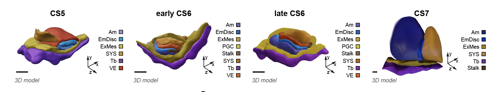

# Linear regression and logistic regression  {#logistic-regression}

In section \@ref(regression) we briefly recap linear regression. As a real-world example we demonstrate the use of linear regression to predict gene expression values as a function of time. In this section we also demonstrate how, by breaking data into *training and test sets*, we can choose between models of increasing complexity in order to select one that is optimal in terms of predictive accuracy. Such *models* can be used to make predictions about the future (or at intermediate points lacking data) which may form the basis for automated decision making. 

In section \@ref(logistic-regression1) we recap logistic regression (section \@ref(logistic-regression)), and demonstrate how such approaches can be used to predict pathogen infection status in *Arabidopsis thaliana*. By doing so we identify key marker genes indicative of pathogen growth.

## Regression {#regression}

To recap our understanding of regression we will make use of an existing dataset which captures the gene expression levels in the model plant *Arabidopsis thaliana* following inoculation with *Botrytis cinerea* [[@windram2012arabidopsis]](https://academic.oup.com/plcell/article/24/9/3530/6100561), a necrotrophic pathogen considered to be one of the most important fungal plant pathogens due to its ability to cause disease in a range of plants. Specifically this dataset is a time series measuring the gene expression in *Arabidopsis* leaves following inoculation with *Botrytis cinerea* over a $48$ hour time window, with observations taken at $2$ hour intervals (see \@ref(fig:bot)). Whilst this example is biological in motivation the methods we discuss should be general and applicable to other collections of time series data, and it may be helpful to instead think of things in terms of *input variables* and *output variables*.


<div class="figure" style="text-align: center">

<p class="caption">(\#fig:bot)Botrytis infection of Arabidopsis over a 48 hour window</p>
</div>


The dataset is available from GEO (GSE39597) but a pre-processed version has been deposited in the data folder. This pre-processed data contains the expression levels of a set of $163$ marker genes in tab delimited format. The fist row contains gene IDs for the marker genes (the individual input variables). Column $2$ contains the time points of observations, with column $3$ containing a binary indication of infection status evalutated as $0$ or $1$ according to wether there was a detectable presence of *Botrytis cinerea* tubulin protein. All subsequent columns indicate ($\log_2$) normalised *Arabidopsis* gene expression values from microarrays (V4 TAIR V9 spotted cDNA array). The expression dataset itself contains two time series: the first set of observations represent measurements of *Arabidopsis* gene expression in a control time series (uninfected), from $2h$ through $48h$ at $2$-hourly intervals, and therefore capture dynamic aspects natural plant processes, including circadian rhythms; the second set of observations represents an infected dataset, again commencing $2h$ after inoculation with *Botyris cinerea* through to $48h$. Both conditions are replicated a number of times. 

Within this section our question is usually framed in the form of "how does this gene's expression change over time." The output variable will typically be the expression level of a gene of interest, denoted $\mathbf{y} =(y_1,\ldots,y_n)^\top$, with the explanatory variable being time, $\mathbf{X} =(t_1,\ldots,t_n)^\top$. We can read the dataset into {R} as follows:


```r
D <- read.csv(file = "data/Arabidopsis/Arabidopsis_Botrytis_pred_transpose_3.csv", header = TRUE, sep = ",", row.names=1)
```

To take a look at the data in the R environment simply type the name of the variable:


From this we can see for ourself that the data consists of several variables measured over a time course. In fact, this experiment consists of several time series, with measurements of Arabidopsis leaves in response to infection with a necrotophic fungus \emph{Botrytis cinerea}, and a second set of experiments containing gene expression in an uninfected (control) conditions. Each condition has 4 replicates, so $8$ time-series in total. The variables are represented columnwise, including time and gene experssion, all of which are continuous variables. Two variables, labeled as `Class' and `Infec' appear to be binary - we will make use of these later. We can extract out the names of the variables (mostly gene names) as a new variable in R, by taking the column names:


```r
genenames <- colnames(D)
```

We can also pull out the time variables of the control time series. From the structure of the data we know that the first $96$ rows correspond to control ($4$ sets of $24$), with the second $96$ corresponding to infection.


```r
Xs <- D$Time[1:96]
```

whilst for the treatment the times would be:

```r
Xs2 <- D$Time[97:nrow(D)]
```

Another way we can pull out data is to rely on indexing. For example if we did:


```r
timeind <- which(genenames=="Time")
```

This would tell us which colum contains the variable `Time'. We could then pull out the data:


```r
genenames <- colnames(D)
Xs2 <- D[97:nrow(D),timeind]
```

which is exactly the same as line 41.

Before we get down to doing any real Machine Learning we first need to familiarise ourself with the data. In fact, it helps a lot if we come armed with a well thought out question: this will help us generate optimal datasets to begin with (or at the very least steer which datasets we will use), and will guide what methods we use to analyse the dataset. As previously suggested, our question going forward will be something like `how does gene expression change over time and in response to infection'.

Let's start by plotting one of the gene expression variables (AT2G28890) as a function of time. The standard plotting we used throughout this course will be ggplot. It makes for very nice plotting, but can be sometimes be a little obscure in syntax, so the code below is probably more opaque than is necessary.


```r
library(ggplot2)
ggplot(D, aes(x = Time, y = AT2G28890, colour = factor(Class)) ) + geom_point(size=2.5) + theme_bw()
```


So here `Time' is our explanatory variable, the variable that is generally easy to measure, and `AT2G28890' represents our output variable, the one we're actually interested in. In the above plot we can see both a change in the variable over time, and a striking difference between the control versus infected time series. Depending on the number of variables we could do this for each variable in turn, but this would be tedious for larger datasets when we have thousands or even tens of thousands of variables. A heatmap is a good way to visualise many variables simultaneously. In fact, let's take a look at the heatmap of the infected time series minus the control using the `pheatmap' function. For ease of interpretation we will do this for replicate one only:


```r
library(pheatmap)
DeltaVals <- t(D[97:120,3:164] - D[1:24,3:164]) #Here we subtract the expression of the control from infected for replicate 1
pheatmap(DeltaVals, cluster_cols = FALSE, cluster_rows = TRUE)
```

In the above snippet we have additionally clustered the values to bring out the signal even more. We can clerly see strong patterns in the data that show both up-regulation and down-regulation of genes over time. This is the beginning of an exploratory analysis we might do to gauge wether the dataset contains useful information - only then might we begin to use ML to ask questions of it. In the next section we will undertake a very simple task: we will focus on the gene AT2G28890 and in either the control or infection time series we will try to identify the functional nature of the expression pattern.

### Linear regression {#linear-regression}

Now that we have an idea about what our dataset is, and are sure of its quality, we can start to do something with it. Here we have a time series (a number of time-series, in fact), and want to develop an understanding of how specific genes are changing over time: this would allow us to predict what gene expression might be doing at some point in the future (forecasting) or uncover something about the physical nature of the system i.e., what kind of function best describes the behavior. To do so we first need a *model* for how we expect the variable to behave. One of the simplest models we could assume is linear regression, which assumes that the variable of interest, denoted $y$, depends on an explanatory variable, $x$, via:

$y = m x + c.$

For a typical set of data, we have a vector of observations, $\mathbf{y} = (y_1,y_2,\ldots,y_n)$ with a corresponding set of explanatory variables. For now we can assume that the explanatory variable is scalar, for example time (in hours), such that we have a set of observations, $\mathbf{X} = (t_1,t_2,\ldots,t_n)$. Using linear regression we aim to infer the parameters $m$ and $c$, which will tell us something about the relationship between the two variables, and allow us to make predictions at a new set of locations, $\mathbf{X}*$. 

But how do we infer these parameters? The answer is we do so by empirically minimising/maximising some *objective function*, for example the sum squared error. Specifically, for a given value of $m$ and $c$ we can make predictions about what the value of $y$ is for any given vallue of $x$, which we can then compare to a measured value. We therefore split that data into two: a training set, $\{ \mathbf{X}_{train}, \mathbf{y}_{train}\}$, and a test set, $\{ \mathbf{X}_{test}, \mathbf{y}_{test}\}$. Using the training set we can can we can find a value of $m$ and $c$ such that the sum of the squared difference between predictions of the model at locations $\mathbf{X}_{train}$, denoted $\mathbf{y}^\prime$, and the actual observed values $\mathbf{y}_{train}$ are in some way minimal. A number of other *objective functions* exist, each of which comes with their own set nuances. A key benefit of using the sum squared error in this case is that optimisation is mathematically tractable: that is we can directly solve the equation rather than having to do iterative searches.

Within R, all linear regression can be implemented via the lm function. In the example below, we perform linear regression for the gene expression of AT2G28890 as a function of time, using $3$ of the $4$ infection time series (saving the fourth for validation):


```r
linmod <- lm(AT2G28890~Time, data = D[4*24 +1:8*24,])
```

Here the {lm} function has analytically identified the gradient and offset ($m$ and $c$ parameters) based upon all 24 time points (4 replicates), and we can take a look at those parameters via {linmod$oefficients}. In general, it is not a very good idea to infer parameters using all of the data. Doing so would leave no way to choose betwee different models and evaluate for overfitting. Ideally, we wish to partition the dataset into a training set, and an evaluation set, with parameters evaluated on the training set, and model performance summarised over the evaluation set. We can of course partition this dataset manually, or use a package to do so. The {caret} package is a machine learning wrapper that allows easy partitions of the dataset. Linear regression is implemented within the {caret} package, allowing us to make use of these utilities. In fact, within caret, linear regression is performed by calling the function lm.

In the example, below, we perform linear regression for gene AT2G28890, and predict the expression pattern for that gene using the {predict} function:


```r
library(caret)
```

```
## Warning: package 'caret' was built under R version 3.5.2
```

```
## Loading required package: lattice
```

```
## Warning: package 'lattice' was built under R version 3.5.2
```

```r
library(mlbench)
library(ggplot2)

set.seed(1)

geneindex <- which(genenames=="AT2G28890")

startind <- (4*24)+1
endind <- 7*24
xtrain = D[startind:endind,1]
ytrain = D[startind:endind,geneindex]

lrfit <- train(y~., data=data.frame(x=xtrain,y=ytrain ), method = "lm")
predictedValues<-predict(lrfit)
```

Note that here we have again manually selected the first three replicates from the infection time series (indexed by rows $97-168$) and thus have saved replicate $4$ for evaluating performance. As an alternative, we could have instead randomly partitioned the data into a training set and test set, although there is no exact prescirption for doing so, and anthing between a $60/40$ and $80/20$ split is common. If we went donwn this route, our code would look something like:


and voila, we have our training and test sets. Alternative way we could split the data is via the createDataPartition function:


An important side note is that here is that, on lines 101 we have set the random number generator to help ensure our code is repeatable. Another thing we will need to do to help make things more repeatable is to take note of what package numbers we used. We can do so by printing the session info:


```r
print(sessionInfo())
```

```
## R version 3.5.1 (2018-07-02)
## Platform: x86_64-apple-darwin15.6.0 (64-bit)
## Running under: macOS  10.14.6
## 
## Matrix products: default
## BLAS: /Library/Frameworks/R.framework/Versions/3.5/Resources/lib/libRblas.0.dylib
## LAPACK: /Library/Frameworks/R.framework/Versions/3.5/Resources/lib/libRlapack.dylib
## 
## locale:
## [1] en_GB.UTF-8/en_GB.UTF-8/en_GB.UTF-8/C/en_GB.UTF-8/en_GB.UTF-8
## 
## attached base packages:
## [1] stats     graphics  grDevices utils     datasets  methods   base     
## 
## other attached packages:
## [1] mlbench_2.1-1   caret_6.0-86    lattice_0.20-40 ggplot2_3.2.1  
## 
## loaded via a namespace (and not attached):
##  [1] Rcpp_1.0.4           lubridate_1.7.4      listenv_0.8.0       
##  [4] class_7.3-15         digest_0.6.25        ipred_0.9-12        
##  [7] foreach_1.5.1        utf8_1.1.4           parallelly_1.23.0   
## [10] R6_2.5.0             plyr_1.8.6           stats4_3.5.1        
## [13] evaluate_0.14        highr_0.8            pillar_1.6.0        
## [16] rlang_0.4.10         lazyeval_0.2.2       data.table_1.12.8   
## [19] jquerylib_0.1.3      rpart_4.1-15         Matrix_1.2-18       
## [22] rmarkdown_2.7        labeling_0.4.2       splines_3.5.1       
## [25] gower_0.2.1          stringr_1.4.0        munsell_0.5.0       
## [28] compiler_3.5.1       xfun_0.12            pkgconfig_2.0.3     
## [31] globals_0.14.0       htmltools_0.5.1.1    nnet_7.3-13         
## [34] tidyselect_1.1.1     tibble_3.1.1         prodlim_2019.11.13  
## [37] bookdown_0.20        codetools_0.2-18     fansi_0.4.1         
## [40] future_1.21.0        crayon_1.4.1         dplyr_1.0.5         
## [43] withr_2.4.1          ModelMetrics_1.2.2.2 MASS_7.3-51.5       
## [46] recipes_0.1.17       grid_3.5.1           nlme_3.1-145        
## [49] jsonlite_1.6.1       gtable_0.3.0         lifecycle_1.0.0     
## [52] DBI_1.1.1            magrittr_1.5         pROC_1.16.2         
## [55] scales_1.1.1         future.apply_1.7.0   stringi_1.4.6       
## [58] reshape2_1.4.3       farver_2.0.3         timeDate_3043.102   
## [61] bslib_0.2.5.1        ellipsis_0.3.0       generics_0.1.0      
## [64] vctrs_0.3.8          lava_1.6.10          iterators_1.0.13    
## [67] tools_3.5.1          glue_1.3.2           purrr_0.3.3         
## [70] parallel_3.5.1       survival_3.1-11      colorspace_1.4-1    
## [73] knitr_1.28           sass_0.4.0
```

Or look at a specific package:


```r
packageVersion("ggplot2")
```

```
## [1] '3.2.1'
```

A summary of the model, including parameters, can be printed out to screen using the {summary} function:


```r
summary(lrfit)
```

```
## 
## Call:
## lm(formula = .outcome ~ ., data = dat)
## 
## Residuals:
##     Min      1Q  Median      3Q     Max 
## -3.3862 -0.3787  0.0814  0.4267  1.7164 
## 
## Coefficients:
##              Estimate Std. Error t value Pr(>|t|)    
## (Intercept) 10.380430   0.201695  51.466  < 2e-16 ***
## x           -0.062616   0.007058  -8.872 4.54e-13 ***
## ---
## Signif. codes:  0 '***' 0.001 '**' 0.01 '*' 0.05 '.' 0.1 ' ' 1
## 
## Residual standard error: 0.8291 on 70 degrees of freedom
## Multiple R-squared:  0.5293,	Adjusted R-squared:  0.5226 
## F-statistic: 78.71 on 1 and 70 DF,  p-value: 4.543e-13
```

Returning to our task, we might ask how well the model has fitted the data. Conveniently, in cases where we do not specify otherwise, {caret} will perform $k$-fold cross validation on the training set, and we can look at various metrics on the held out data in {lrfit$results}. We can also make predictions at new points (for example if we are interested in forecasting at some time in the future) by specifying a new set of time points over which to make a prediction:


```r
newX <- seq(0,48,by=0.5)
forecastValues<-predict(lrfit,newdata = data.frame(x=newX) )

ggplot(data.frame(x=xtrain,y=ytrain ), aes(x = x, y = y)) + geom_point(size=2.5)  + geom_point(color='blue') +
geom_line(color='blue',data = data.frame(x=newX,y=forecastValues), aes(x=x, y=y)) + theme_bw()
```


In general the fit seems to capture a general downward trend. We can also take a look at predictions in the held-out $4$th replicate:


```r
newX <- D[169:192,1]
forecastValues<-predict(lrfit,newdata = data.frame(x=newX) )
residuals <- forecastValues - D[169:192,geneindex]
plot(residuals, type="p",col="black",main=genenames[geneindex])
```


```r
ggplot(data.frame(x=newX,y=residuals ), aes(x = x, y = y)) + geom_point(size=2.5)  + geom_point(color='blue') + theme_bw()
```


By and large, for a good model, we would expect the residuals to look roughly random centred on $0$. If we see structure, this may be a clue that our model is not as useful as it could be. We can also summarise performence by e.g., calculating the root mean squared error on the held out data:


```r
RMSE <- sqrt( mean( (forecastValues - D[169:192,geneindex])^2 ) )
```

The error on held out data comes into its own when looking to compare models, as we shall see in the next section. 

Finally, let's also fit a linear model to the control dataset (again only using 3 replicates), and plot the inferred results alongside the observation data for both fitted models:


```r
newX <- seq(0,48,by=0.5)
lrfit2 <- train(y~., data=data.frame(x=D[1:72,1],y=D[1:72,geneindex]), method = "lm")
lrfit <- train(y~., data=data.frame(x=D[97:168,1],y=D[97:168,geneindex]), method = "lm")
predictedValues2 <- predict(lrfit2, newdata = data.frame(x=newX))
predictedValues<-predict(lrfit,newdata = data.frame(x=newX) )

ggplot(D, aes(x = Time, y = AT2G28890, colour = factor(Class))) + geom_point(size=2.5) + scale_color_manual(values=c("red", "blue")) +
geom_line(color='red',data = data.frame(x=newX,y=predictedValues2), aes(x=x, y=y)) +
geom_line(color='blue',data = data.frame(x=newX,y=predictedValues), aes(x=x, y=y)) + theme_bw()
```


Whilst the above model appeared to do reasonably well at capturing the general trends in the dataset, if we take a closer look at the control data (in red), you may notice that, visually, there appears to be more structure to the data than indicated by the model fit. One thing we can do is take a look at the residuals fo each model: if there is structure in the residuals, it would suggest the model is not capturing the full richness of the model. Indeed, if we look AT2G28890 up on [CircadianNET](http://viridiplantae.ibvf.csic.es/circadiaNet/genes/atha/AT2G28890.html), we will see it is likely circadian in nature ($p<5\times10^{-5}$) suggesting there may be some rhythmicity to it. To better accommodate the complex nature of this data we may need something more complicated. 

### Polynomial regression

In general, linear models will not be appropriate for a large variety of datasets, particularly when the variables of interest are nonlinear. We can instead try to fit more complex models, such as a quadratic function, which has the following form:

$y = m_1 x + m_2 x^2 + c,$

where $m = [m_1,m_2,c]$ represent the parameters we're interested in inferring. An $n$th-order polynomial has the form:

$y = \sum_{i=1}^{n} m_i x^i + c.$

where $m = [m_1,\ldots,m_n,c]$ are the free parameters. As before, the goal is to try to find values for these parameters such that we maximise/minimise some objective function. Within R we can infer more complex polynomials from the data using the {lm} package by calling the {poly} function when specifying the symbolic model. In the example below we fit a $3$rd order polynomial (the order of the polynomial is specified via the {degree} variable):
 

```r
lrfit3 <- lm(y~poly(x,degree=3), data=data.frame(x=D[1:72,1],y=D[1:72,geneindex]))
```
 
We can agin do this in caret: in the snippet, below, we fit $3$rd order polynomials to the control and infected datasets, and plot the fits alongside the data.
 

```r
lrfit3 <- train(y~poly(x,degree=3), data=data.frame(x=D[1:72,1],y=D[1:72,geneindex]), method = "lm")
lrfit4 <- train(y~poly(x,degree=3), data=data.frame(x=D[97:168,1],y=D[97:168,geneindex]), method = "lm")

newX <- seq(0,48,by=0.5)

predictedValues<-predict(lrfit3,newdata = data.frame(x=newX) )
predictedValues2 <- predict(lrfit4, newdata = data.frame(x=newX))

ggplot(D, aes(x = Time, y = AT2G28890, colour = factor(Class))) + geom_point(size=2.5) + scale_color_manual(values=c("red", "blue")) +
geom_line(color='blue',data = data.frame(x=newX,y=predictedValues2), aes(x=x, y=y)) +
geom_line(color='red',data = data.frame(x=newX,y=predictedValues), aes(x=x, y=y)) + theme_bw()
```


 
Note that, by eye, the fit appears to be a little better than for the linear regression model. Well, maybe! We can quantify the accuracy of the models by looking at the root-mean-square error (RMSE) on the hold-out data (test-set), defined as:

$\mbox{RMSE} = \sqrt{\sum_{i=1}^n (\hat{y_i}-y_i)^2/n}$

where $\hat{y_i}$ is the predicted value (model prediction) and $y_i$ the observed value of the $i$th (held out) datapoint.

What happens if we fit a much higher order polynomial? Try fitting a polynomial with degree up to $d = 10$ and plotting the result. 


```r
lrfit3 <- train(y~poly(x,degree=12), data=data.frame(x=D[1:72,1],y=D[1:72,geneindex]), method = "lm")
lrfit4 <- train(y~poly(x,degree=12), data=data.frame(x=D[97:168,1],y=D[97:168,geneindex]), method = "lm")

newX <- seq(0,48,by=0.5)

predictedValues<-predict(lrfit3,newdata = data.frame(x=newX) )
predictedValues2 <- predict(lrfit4, newdata = data.frame(x=newX))

ggplot(D, aes(x = Time, y = AT2G28890, colour = factor(Class))) + geom_point(size=2.5) + scale_color_manual(values=c("red", "blue")) +
geom_line(color='blue',data = data.frame(x=newX,y=predictedValues2), aes(x=x, y=y)) +
geom_line(color='red',data = data.frame(x=newX,y=predictedValues), aes(x=x, y=y)) + theme_bw()
```


As we increase the model complexity the fit may *appear* to match perfectly well to the training set. However, such models become completely useless for prediction purposes. We are overfitting! This is why we use held out data, so that we can evaluate, empirically, when a model is useful, or when it is simply memorising the training set (noise and nuance and all). 

Using our gene of interest explore the model complexity i.e., try fitting polynomial models of increasing complexity. Plot the RMSE on the test set as a function of degree. Which model fits best?

In the code below we systematically fit a model with increasing degree and evaluate/plot the RMSE on the held out data.


```r
xtrain <- D[1:72,1]
ytrain <- D[1:72,geneindex]
xtest <- D[73:96,1]
ytest <- D[73:96,geneindex]

RMSE <- as.data.frame( matrix(NA, nrow = 10, ncol = 2) ) #rep(NULL, c(10,2))
lrfit1 <- train(y~poly(x,degree=1), data=data.frame(x=xtrain,y=ytrain), method = "lm")
RMSE[1,1] <- lrfit1$results$RMSE
predictedValues1<-predict(lrfit1, newdata = data.frame(x=ytest) )
RMSE[1,2] <- sqrt( mean( (predictedValues1-ytest)^2 ) )

lrfit2 <- train(y~poly(x,degree=2), data=data.frame(x=xtrain,y=ytrain), method = "lm")
RMSE[2,1] <- lrfit2$results$RMSE
predictedValues2<-predict(lrfit2, newdata = data.frame(x=xtest) )
RMSE[2,2] <- sqrt( mean( (predictedValues2-ytest)^2 ) )

lrfit3 <- train(y~poly(x,degree=3), data=data.frame(x=xtrain,y=ytrain), method = "lm")
RMSE[3,1] <- lrfit3$results$RMSE
predictedValues3<-predict(lrfit3, newdata = data.frame(x=xtest) )
RMSE[3,2] <- sqrt( mean( (predictedValues3-ytest)^2 ) )

lrfit4 <- train(y~poly(x,degree=4), data=data.frame(x=xtrain,y=ytrain), method = "lm")
RMSE[4,1] <- lrfit4$results$RMSE
predictedValues4<-predict(lrfit4, newdata = data.frame(x=xtest) )
RMSE[4,2] <- sqrt( mean( (predictedValues4-ytest)^2 ) )

lrfit5 <- train(y~poly(x,degree=5), data=data.frame(x=xtrain,y=ytrain), method = "lm")
RMSE[5,1] <- lrfit5$results$RMSE
predictedValues5<-predict(lrfit5, newdata = data.frame(x=xtest) )
RMSE[5,2] <- sqrt( mean( (predictedValues5-ytest)^2 ) )

lrfit6 <- train(y~poly(x,degree=6), data=data.frame(x=xtrain,y=ytrain), method = "lm")
RMSE[6,1] <- lrfit6$results$RMSE
predictedValues6<-predict(lrfit6, newdata = data.frame(x=xtest) )
RMSE[6,2] <- sqrt( mean( (predictedValues6-ytest)^2 ) )

lrfit7 <- train(y~poly(x,degree=7), data=data.frame(x=xtrain,y=ytrain), method = "lm")
RMSE[7,1] <- lrfit7$results$RMSE
predictedValues7<-predict(lrfit7, newdata = data.frame(x=xtest) )
RMSE[7,2] <- sqrt( mean( (predictedValues7-ytest)^2 ) )

lrfit8 <- train(y~poly(x,degree=8), data=data.frame(x=xtrain,y=ytrain), method = "lm")
RMSE[8,1] <- lrfit8$results$RMSE
predictedValues8<-predict(lrfit8, newdata = data.frame(x=xtest) )
RMSE[8,2] <- sqrt( mean( (predictedValues8-ytest)^2 ) )

lrfit9 <- train(y~poly(x,degree=9), data=data.frame(x=xtrain,y=ytrain), method = "lm")
RMSE[9,1] <- lrfit9$results$RMSE
predictedValues9<-predict(lrfit9, newdata = data.frame(x=xtest) )
RMSE[9,2] <- sqrt( mean( (predictedValues9-ytest)^2 ) )

lrfit10 <- train(y~poly(x,degree=15), data=data.frame(x=xtrain,y=ytrain), method = "lm")
RMSE[10,1] <- lrfit10$results$RMSE
predictedValues10<-predict(lrfit10, newdata = data.frame(x=xtest) )
RMSE[10,2] <- sqrt( mean( (predictedValues10-ytest)^2 ) )
```

We can now look at the RMSE in the held-out data as a function of polynomial degree:


```r
ggplot(data=RMSE, aes(x=c(1,2,3,4,5,6,7,8,9,10), y=V2)) + geom_bar(stat="identity", fill="steelblue") + theme_bw()
```

Let's plot the supposed best model:


```r
lrfit3 <- train(y~poly(x,degree=8), data=data.frame(x=D[1:72,1],y=D[1:72,geneindex]), method = "lm")
lrfit4 <- train(y~poly(x,degree=8), data=data.frame(x=D[97:168,1],y=D[97:168,geneindex]), method = "lm")

newX <- seq(0,48,by=0.5)

predictedValues<-predict(lrfit3,newdata = data.frame(x=newX) )
predictedValues2 <- predict(lrfit4, newdata = data.frame(x=newX))

ggplot(D, aes(x = Time, y = AT2G28890, colour = factor(Class))) + geom_point(size=2.5) + scale_color_manual(values=c("red", "blue")) +
geom_line(color='blue',data = data.frame(x=newX,y=predictedValues2), aes(x=x, y=y)) +
geom_line(color='red',data = data.frame(x=newX,y=predictedValues), aes(x=x, y=y)) + theme_bw()
```


In the above plots, we can see the decrease in RMSE as model complexity increases, and get a hint that it's beginning to increase as models become too complex, but it's not exactly obvious. One issue is that we chose our test set as being one of the four time series (trained on the first $3$), our test locations were at the same points as the input training time series, making it harder to distinguish between models. An alternative approach would be to make a training/test set split over particular time points, for example we might want to pick the last $3$ time points to be our test set.


```r
xtrain <- D[-which(D$Time %in% c(44,46,48) ),1]
ytrain <- D[-which(D$Time %in% c(44,46,48) ),geneindex]
xtest <- D[which(D$Time %in% c(44,46,48) ),1]
ytest <- D[which(D$Time %in% c(44,46,48) ),geneindex]

RMSE <- as.data.frame( matrix(NA, nrow = 10, ncol = 2) ) #rep(NULL, c(10,2))
lrfit1 <- train(y~poly(x,degree=1), data=data.frame(x=xtrain,y=ytrain), method = "lm")
RMSE[1,1] <- lrfit1$results$RMSE
predictedValues1<-predict(lrfit1, newdata = data.frame(x=ytest) )
RMSE[1,2] <- sqrt( mean( (predictedValues1-ytest)^2 ) )

lrfit2 <- train(y~poly(x,degree=2), data=data.frame(x=xtrain,y=ytrain), method = "lm")
RMSE[2,1] <- lrfit2$results$RMSE
predictedValues2<-predict(lrfit2, newdata = data.frame(x=xtest) )
RMSE[2,2] <- sqrt( mean( (predictedValues2-ytest)^2 ) )

lrfit3 <- train(y~poly(x,degree=3), data=data.frame(x=xtrain,y=ytrain), method = "lm")
RMSE[3,1] <- lrfit3$results$RMSE
predictedValues3<-predict(lrfit3, newdata = data.frame(x=xtest) )
RMSE[3,2] <- sqrt( mean( (predictedValues3-ytest)^2 ) )

lrfit4 <- train(y~poly(x,degree=4), data=data.frame(x=xtrain,y=ytrain), method = "lm")
RMSE[4,1] <- lrfit4$results$RMSE
predictedValues4<-predict(lrfit4, newdata = data.frame(x=xtest) )
RMSE[4,2] <- sqrt( mean( (predictedValues4-ytest)^2 ) )

lrfit5 <- train(y~poly(x,degree=5), data=data.frame(x=xtrain,y=ytrain), method = "lm")
RMSE[5,1] <- lrfit5$results$RMSE
predictedValues5<-predict(lrfit5, newdata = data.frame(x=xtest) )
RMSE[5,2] <- sqrt( mean( (predictedValues5-ytest)^2 ) )

lrfit6 <- train(y~poly(x,degree=6), data=data.frame(x=xtrain,y=ytrain), method = "lm")
RMSE[6,1] <- lrfit6$results$RMSE
predictedValues6<-predict(lrfit6, newdata = data.frame(x=xtest) )
RMSE[6,2] <- sqrt( mean( (predictedValues6-ytest)^2 ) )

lrfit7 <- train(y~poly(x,degree=7), data=data.frame(x=xtrain,y=ytrain), method = "lm")
RMSE[7,1] <- lrfit7$results$RMSE
predictedValues7<-predict(lrfit7, newdata = data.frame(x=xtest) )
RMSE[7,2] <- sqrt( mean( (predictedValues7-ytest)^2 ) )

lrfit8 <- train(y~poly(x,degree=8), data=data.frame(x=xtrain,y=ytrain), method = "lm")
RMSE[8,1] <- lrfit8$results$RMSE
predictedValues8<-predict(lrfit8, newdata = data.frame(x=xtest) )
RMSE[8,2] <- sqrt( mean( (predictedValues8-ytest)^2 ) )

lrfit9 <- train(y~poly(x,degree=9), data=data.frame(x=xtrain,y=ytrain), method = "lm")
RMSE[9,1] <- lrfit9$results$RMSE
predictedValues9<-predict(lrfit9, newdata = data.frame(x=xtest) )
RMSE[9,2] <- sqrt( mean( (predictedValues9-ytest)^2 ) )

lrfit10 <- train(y~poly(x,degree=15), data=data.frame(x=xtrain,y=ytrain), method = "lm")
RMSE[10,1] <- lrfit10$results$RMSE
predictedValues10<-predict(lrfit10, newdata = data.frame(x=xtest) )
RMSE[10,2] <- sqrt( mean( (predictedValues10-ytest)^2 ) )

ggplot(data=RMSE, aes(x=c(1,2,3,4,5,6,7,8,9,10), y=V2)) + geom_bar(stat="identity", fill="steelblue") + theme_bw()
```

Now things become a little more obvious. In this example polynomial of degree $4$ is the best fit. We can plot the best models:


```r
lrfit3 <- train(y~poly(x,degree=4), data=data.frame(x=D[1:72,1],y=D[1:72,geneindex]), method = "lm")
lrfit4 <- train(y~poly(x,degree=4), data=data.frame(x=D[97:168,1],y=D[97:168,geneindex]), method = "lm")

newX <- seq(0,48,by=0.5)

predictedValues<-predict(lrfit3,newdata = data.frame(x=newX) )
predictedValues2 <- predict(lrfit4, newdata = data.frame(x=newX))

ggplot(D, aes(x = Time, y = AT2G28890, colour = factor(Class))) + geom_point(size=2.5) + scale_color_manual(values=c("red", "blue")) +
geom_line(color='blue',data = data.frame(x=newX,y=predictedValues2), aes(x=x, y=y)) +
geom_line(color='red',data = data.frame(x=newX,y=predictedValues), aes(x=x, y=y)) + theme_bw()
```


Which seems to suggest that, for this dataset, a more complex model is better than the simple linear regression we began with, which is in line with our intuition of this gene being a circadian one. In practice, high-order polynomials are not ideal models for real world data, and we will instead move to more flexible approaches to regression including decision trees, neural networks. Nevertheless, the principle of using held out data to select a good model remains true in these cases. And now that we have a understanding of regression in the context of machine learning, we can easily incroporate more complex models (including nonlineaar regression) into our toolbox, and use these diverse approaches for a variey of means: for making predictions of continuous variables, for making decisions about future, and for extracing understanding about the nature of the dataset itself (model selection).

Excerise 1.1: Think about how regression models can be used as a means for testing differential expression of time-series data. Hint: frame this as alternative hypothesis, the first where there is no differetial expression, the time series should be described by an identical model, whilst the second case, the idividual time series would require two independent models.

Excercise 1.2: Given a set of time series, like our Arabidopsis dataset, think about how regression can be used to infer regulatory networks.


### Logistic regression {#logistic-regression1}

The type of linear regression models we've been using up to this point deal with real-valued observation data, $\mathbf{y}$, and are therefore not appropriate for classification. To deal with cases where $\mathbf{y}$ is a binary outcome, we instead have to think of different *models*, use different *objective functions* to optimise, and use different *metrics* to choose between competing models. Fortunately, however, much of the framework used for regression remains the same. 

Logistic regression is a model which can be used for data in which there is a general transition from one state to another as a function of the input variable e.g., where gene expression levels might predict a binary disease state, with lower levels indicating disease-free, and higher-levels indicating a diseased state. Logistic regression does not perform classification *per se*, but instead models the probability of a successful event (e.g., the probability that for a given expression the observation was in the diseased free state, $0$, or diseased state $1$). As probability is a real-valued number (between $0$ and $1$), technically this remains a form of regression. However, we can use logistic regression to make classifications by setting thresholds on those probabilities i.e., for prediction purposes we decide everything with $p\ge 0.5$ is a success ($1$), and everything below is a $0$.  

Another way to think about linear regression is that we are fitting a linear model to the logit (natural log) of the log-odds ratio:

$\ln \biggl{(}\frac{p(x)}{1-p(x)}\biggr{)} = c + m_1 x_1.$

Although this model is not immediately intuitive, if we solve for $p(x)$ we get:

$p(x) = \frac{1}{1+\exp(-c - m_1 x_1)}$.

We have thus specified a function that indicates the probability of success for a given value of $x$ e.g., $P(y=1|x)$. In general can think of our data as a being a sample from a Bernoulli trial, and can therefore write down the likelihood for a set of observations ${\mathbf{X},\mathbf{y}}$:

$\mathcal{L}(c,m_1) = \prod_{i=1}^n p(x_i)^{y_i} (1-p(x_i)^{1-y_i})$.

This is our *objective function* that we seek to maximise. Unlike linear regression, these models do not admit a closed form solution, but can be solved iteratively. The end result is the same, we find values $(c,m_1)$ that return the greatest value of $\mathcal{L}(c,m_1)$. Within {caret}, logistic regression can applied using the {glm} function. 

To illustate this we will again make use of our plant dataset. Recall that the third column represents a binary variable indicative of infection status. That is, indicating the population of the *Botrytis cinerea* pathogen based on detectable *Botrytis* tubulin. Thus, the value of this variable is $0$ for the entirety of the control time series, and $0$ for the earliest few time points of the infected time series, since Botrytis takes some time to proliferate and breach the plant cell walls. 

In the codde, below, we will use logistic regression to learn a set of markers capable of predicting infection status. To begin with, let's see if *time* is informative of infection status:


```
## Warning: package 'pROC' was built under R version 3.5.2
```

```
## Type 'citation("pROC")' for a citation.
```

```
## 
## Attaching package: 'pROC'
```

```
## The following objects are masked from 'package:stats':
## 
##     cov, smooth, var
```

```
## Loading required package: gplots
```

```
## 
## Attaching package: 'gplots'
```

```
## The following object is masked from 'package:stats':
## 
##     lowess
```

Here we have again split the data into a training and test set. We can calulate the probability that each datapoint in the test set belongs to class $0$ or $1$:


```r
prob <- predict(mod_fit, newdata=data.frame(x = Dtest$Time, y = as.factor(Dtest$Infec)), type="prob")
pred <- prediction(prob$`1`, as.factor(Dtest$Infec))
```

In the above snippet we calculate the probability of each data point belonging to class 0 vs class 1, and using an incremented set of cutoffs use these to make a binary classification. To evaluate how well the algorithm has done, we can calculate a variety of summary statistics. For example for a given cutoff (say 0.5) we can calculate the number of true positives, true negatives, false positives, and false negatives. A useful summary is to plot the ROC curve (false positive rate versus true positive rate for all cutoffs) and calculate the area under that curve. For a perfect algorithm the area under this curve (AUC) will be equal to $1$, whereas random assignment would give an area of $0.5$. In the example below, we will calculate the AUC for a logistic regression model:


```r
perf <- performance(pred, measure = "tpr", x.measure = "fpr")
plot(perf)
```


```r
auc <- performance(pred, measure = "auc")
auc <- auc@y.values[[1]]
auc
```

```
## [1] 0.6111111
```

Okay, so a score of $0.61$ is certainly better than random, but not particularly good. This is perhaps not surprising, as half the time series (the control) is uninfected over the entirety of the time series, whilst in the second times series *Botrytis* is able to infect from around $8h$ onward. The slightly better than random performance therefore arises due the slight bias in the number of instances of each class. Indeed, if we plot infection status vs time, we should be able to see why the model fails to be predictive.

Let us see if AT2G28890 expression is informative:


```r
mod_fit <- train(y ~ ., data=data.frame(x = Dtrain$AT2G28890, y = as.factor(Dtrain$Infec)), method="glm", family="binomial")
prob <- predict(mod_fit, newdata=data.frame(x = Dtest$AT2G28890, y = as.factor(Dtest$Infec)), type="prob")
pred <- prediction(prob$`1`, as.factor(Dtest$Infec))
perf <- performance(pred, measure = "tpr", x.measure = "fpr")
plot(perf)
```


```r
auc <- performance(pred, measure = "auc")
auc <- auc@y.values[[1]]
auc
```

```
## [1] 0.7795414
```

Both the ROC curve and the AUC score are much better. In the example below, we now regress infection status against individual gene expression levels for all genes in our set. The idea is to identify genes that have expression values indicative of *Botrytis* infection: marker genes.


```r
ggplot(data.frame(x=seq(4,165,1),y=aucscore[4:165]), aes(x = x, y = y)) + geom_point(size=2.5)  + geom_point(color='blue') + geom_hline(aes(yintercept = 0.8)) + theme_bw()
```


We note that, several genes in the list appear to have AUC scores much greater than $0.6$. We can take a look at some of the genes with high predictive power:


```r
genenames[which(aucscore>0.8)]
```

```
##  [1] "AT1G13030" "AT1G32230" "AT1G45145" "AT1G67170" "AT2G21380" "AT2G27480"
##  [7] "AT2G35500" "AT2G44950" "AT3G02150" "AT3G09980" "AT3G11590" "AT3G13720"
## [13] "AT3G44720" "AT3G48150" "AT3G49570" "AT3G54170" "AT4G00710" "AT4G00980"
## [19] "AT4G01090" "AT4G02150" "AT4G19700" "AT4G26110" "AT4G26450" "AT4G28640"
## [25] "AT4G34710" "AT4G36970" "AT4G39050" "AT5G11980" "AT5G22630" "AT5G25070"
## [31] "AT5G50010" "AT5G56290" "AT5G57210" "AT5G59670" "AT5G66560"
```

Unsurprisingly, among these genes we see a variety whose proteins are known to be targeted by various pathogen effectors, and are therefore directly implicated in the immune response (Table 1). 

Gene | Effector
--- | ---
AT3G25710	|	ATR1_ASWA1
AT4G19700	|	ATR13_NOKS1
AT4G34710	|	ATR13_NOKS1
AT4G39050	|	ATR13_NOKS1
AT5G24660	|	ATR13_NOKS1
AT4G00710	|	AvrRpt2_Pto JL1065_CatalyticDead
AT4G16380	|	HARXL44
AT2G45660	|	HARXL45
AT5G11980	|	HARXL73
AT2G35500	|	HARXLL445
AT1G67170	|	HARXLL470_WACO9
AT4G36970	|	HARXLL470_WACO9
AT5G56250	|	HARXLL470_WACO9
AT3G09980	|	HARXLL516_WACO9
AT5G50010	|	HARXLL60
AT3G44720	|	HARXLL73_2_WACO9
AT5G22630	|	HARXLL73_2_WACO9
AT5G43700	|	HopH1_Psy B728A
Table 1: Genes predictive of infection status of *Botrytis cinerea* whose proteins are targeted by effectors of a variety of pathogens

As always, let's take a look at what our model and the data look like. In this case we plot the training data labels and the fit from the logistic regression i.e., $p(\mathbf{y}=1|\mathbf{x})$:


```r
bestpredictor <- which(aucscore==max(aucscore))[1]
best_mod_fit <- train(y ~., data=data.frame(x = Dtrain[,bestpredictor], y = as.factor(Dtrain$Infec)), family="binomial", method="glm")

xpred <- seq(min(Dtest[,bestpredictor]),max(Dtest[,bestpredictor]),length=200)
ypred <- predict(best_mod_fit,newdata=data.frame(x = xpred),type="prob")[,2]

Data_to_plot <- data.frame(x = Dtest[,bestpredictor],y=Dtest[,3])
ggplot(Data_to_plot, aes(x = x, y = y, colour = factor(y) )) + geom_point(size=2.5) + scale_color_manual(values=c("red", "blue")) +
geom_line(color='red',data = data.frame(x=xpred,y=ypred), aes(x=x, y=y)) + geom_hline(aes(yintercept = 0.5)) + theme_bw()
```


We can see from this plot that the level of AT2G21380 appears to be highly predictive of infection status. When AT2G21380 is low, its almost certain that the *Botrytis cinerea* has gained a foothold; whether this is causal or not, we cannot say, but it is certainly a good marker and a good starting point for further testing.

We could also make predictions using more than one variable. This might be useful, for example to figure out if there are any combinations of genes that together contain additional information. In the snippet of code we search for all combinations with AT2G21380: 

```r
aucscore2 <- matrix(0, 1, 165)
for (i in seq(4,165)){
mod_fit <- train(y ~ ., data=data.frame(x = Dtrain[,unique(c(bestpredictor,i))], y = as.factor(Dtrain$Infec)), method="glm", family="binomial")
prob <- predict(mod_fit, newdata=data.frame(x = Dtest[,unique(c(bestpredictor,i))], y = as.factor(Dtest$Infec)), type="prob")
pred <- prediction(prob$`1`, as.factor(Dtest$Infec))
perf <- performance(pred, measure = "tpr", x.measure = "fpr")
auc <- performance(pred, measure = "auc")
aucscore2[i] <- auc@y.values[[1]]
}
ggplot(data.frame(x=seq(4,165,1),y=aucscore2[4:165]), aes(x = x, y = y)) + geom_point(size=2.5)  + geom_point(color='blue') +  geom_hline(aes(yintercept = max(aucscore) )) + theme_bw()
```


This looks promising - there are a few combinations that allow us to make even better predictions. However, we have made one mistake! If we are to do this properly, we must ensure that we are making decisions on a dataset that has not been seen by the model. In the above case, this would not strictly be true, as we have selected our "best gene" using the test data. Thus to do this properly we would have to either look at pairwise combinations at an earlier step (before we picked our best gene), or have access to a third batch of datapoints on which to do the selection. Indeed it is quite common to see datasets broken down into training, evaluation, and test sets, with the second set used to pick between several competing models. Luckily I have just such a dataset that I have been holding in reserve:


```r
Deval <- read.csv(file = "data/Arabidopsis/Arabidopsis_Botrytis_transpose_3.csv", header = TRUE, sep = ",", row.names=1)
aucscore2 <- matrix(0, 1, 165)
for (i in seq(4,165)){
mod_fit <- train(y ~ ., data=data.frame(x = Dtrain[,unique(c(bestpredictor,i))], y = as.factor(Dtrain$Infec)), method="glm", family="binomial")
prob <- predict(mod_fit, newdata=data.frame(x = Deval[,unique(c(bestpredictor,i))], y = as.factor(Deval$Infec)), type="prob")
pred <- prediction(prob$`1`, as.factor(Deval$Infec))
perf <- performance(pred, measure = "tpr", x.measure = "fpr")
auc <- performance(pred, measure = "auc")
aucscore2[i] <- auc@y.values[[1]]
}
ggplot(data.frame(x=seq(4,165,1),y=aucscore2[4:165]), aes(x = x, y = y)) + geom_point(size=2.5)  + geom_point(color='blue') + geom_vline(aes(xintercept = 28 )) + theme_bw()
```


Here we indicate by a vertical line the index corresponding to the basal model (i.e, AT2G21380 only) and can see there are several combinatorial models that allow us to more accurately predict infection status.  

## Using regression approaches to infer 3D gene expression patterns in marmoset embryos

In our recent paper [[@bergmann2022spatial]](https://www.nature.com/articles/s41586-022-04953-1) we combined laser capture microdissection (LCM) with RNA-sequencing and immunofluorescent staining to generate 3D transcriptional reconstructions of early post-implantation marmoset embryos. Here, adjacent sections were used to build a 3D model of the embryo (see \@ref(fig:embryo)). The 3D position of each LCM within this reconstructed embryo was retained, allowing an interpolation of expression patterns across the embryo using regression (albeit a nonlinear form of rgression). Raw sequencing data is available from ArrayExpress under accession numbers E-MTAB-9367 and E-MTAB-9349.

<div class="figure" style="text-align: center">

<p class="caption">(\#fig:embryo)3D representations of primate embryos at Carnegie stages 5, 6, and 7. Laser capture microdissection allowed comprehesnive RNA-sequencing at near single cell level whislt retaining 3D-sptial information</p>
</div>

In the exammpels below we will take a look at the 3D models and use simple linear regression to investigate anterior-posterior gradients in the embryonic disc. First we will load the 3D "scaffolds" for the embryonic disc and the amnion. This consists of a set of vetices and a set of indices that define faces of the objecct. This example scaffold was constructed from sequential sections of a Carnegie stage 6 (CS6) marmoset embryo. 


```
## 
## Attaching package: 'plotly'
```

```
## The following object is masked from 'package:ggplot2':
## 
##     last_plot
```

```
## The following object is masked from 'package:stats':
## 
##     filter
```

```
## The following object is masked from 'package:graphics':
## 
##     layout
```

We will also load in the 3D locations of the laser capture microdissection samples that we used to do RNA-seq and the gene-expression of those samples. For simplicity I've included a processed expression matrix for a handful of genes. 


```r
D5 <- read.table("data/Embryo/CS6Expression.csv",sep=",",header=T)
```

As an illustrative example of regression we will look at the expression pattern differences in the embryonic disc versus the amnion. In this case we will do regression on embryonic disc and amnion seperately. 


```r
ind1 <- which(D5$Lineage=="EmDisc_CS6")
ind2 <- which(D5$Lineage=="Am_CS6")
```
In the snippet of code below we use plotly to plot the scaffold tissues


We can also visualise where the LCM samples are within the embryo:


Okay so now we can do some regression. We first infer a model using the embryonic disc samples, and then infer a value over the full scaffold region: 


```r
lrfit <- train(expr~x+y+z, data=data.frame(expr=D5$SOX2[ind1],x=D5$X[ind1],y=D5$Y[ind1],z=D5$Z[ind1]), method = "lm")
newX <- data.frame(x=D1$V1,y=D1$V2,z=D1$V3)
predictedValues<-predict(lrfit, newX)
```

We can visualise the interpolated values of $SOX2$ on the embryonic disc: 


We could do the same for the expression level of T and other genes. In the snippets of code below we have opted not to evaluate the code to keep the workbook size down, but these may still be run in your R session.


```r
lrfit <- train(expr~x+y+z, data=data.frame(expr=D5$T[ind1],x=D5$X[ind1],y=D5$Y[ind1],z=D5$Z[ind1]), method = "lm")
newX <- data.frame(x=D1$V1,y=D1$V2,z=D1$V3)
predictedValues<-predict(lrfit, newX)
plot_ly(x = D1$V1, y = D1$V2, z = D1$V3,  
             i = c(D2$V1-1),j=c(D2$V2-1),k=c(D2$V3-1),
             intensity = predictedValues,
             colorscale = list(c(0,'red'),
                               c(0.33,'orange'),
                               c(0.66, 'yellow'),
                               c(1, 'green')),
             type = "mesh3d") %>% layout(scene = list(xaxis = ax, yaxis = ax, zaxis = ax), font = list(color='#FFFFFF'))
```


Here we visualise expression of SOX2 on both the embryonic disc and amnion, in order to see tissue specific biases in gene expression.


```r
lrfit1 <- train(expr~x+y+z, data=data.frame(expr=D5$SOX2[ind1],x=D5$X[ind1],y=D5$Y[ind1],z=D5$Z[ind1]), method = "lm")
lrfit2 <- train(expr~x+y+z, data=data.frame(expr=D5$SOX2[ind2],x=D5$X[ind2],y=D5$Y[ind2],z=D5$Z[ind2]), method = "lm")
newX <- data.frame(x=D1$V1,y=D1$V2,z=D1$V3)
predictedValues1<-predict(lrfit1, newX)
predictedValues2<-predict(lrfit2, newX)
maxE <- max(c(predictedValues1,predictedValues2))
minE <- min(c(predictedValues1,predictedValues2))
#NB this is a hack. Plot_ly rescales internally so to make sure the two barplots are on the same scale we need to make sure they have the same limits. The final two colour points are not used  directly
predictedValues1<- c(predictedValues1,minE,maxE)
predictedValues2<- c(predictedValues2,minE,maxE)

p <- plot_ly(x = D1$V1, y = D1$V2, z = D1$V3,  
             i = c(D2$V1-1),j=c(D2$V2-1),k=c(D2$V3-1),
             intensity = c(predictedValues1),
             colorscale = list(c(0,'red'),
                               c(0.33,'orange'),
                               c(0.66, 'yellow'),
                               c(1, 'green')),
             type = "mesh3d")

p <- p %>% add_trace(x = D1$V1, y = D1$V2, z = D1$V3,  
             i = c(D3$V1-1),j=c(D3$V2-1),k=c(D3$V3-1),
             intensity = c(predictedValues2),
             colorscale = list(c(0,'red'),
                               c(0.33,'orange'),
                               c(0.66, 'yellow'),
                               c(1, 'green')),
             type = "mesh3d") %>% layout(scene = list(xaxis = ax, yaxis = ax, zaxis = ax), font = list(color='#000000'))
p
```

Coversely we can look at an amnion marker VTCN1:


```r
lrfit1 <- train(expr~x+y+z, data=data.frame(expr=D5$VTCN1[ind1],x=D5$X[ind1],y=D5$Y[ind1],z=D5$Z[ind1]), method = "lm")
lrfit2 <- train(expr~x+y+z, data=data.frame(expr=D5$VTCN1[ind2],x=D5$X[ind2],y=D5$Y[ind2],z=D5$Z[ind2]), method = "lm")
newX <- data.frame(x=D1$V1,y=D1$V2,z=D1$V3)
predictedValues1<-predict(lrfit1, newX)
predictedValues2<-predict(lrfit2, newX)
maxE <- max(c(predictedValues1,predictedValues2))
minE <- min(c(predictedValues1,predictedValues2))
#NB this is a hack. Plot_ly rescales internally so to make sure the two barplots are on the same scale we need to make sure they have the same limits. The final two colour points are not used  directly
predictedValues1<- c(predictedValues1,minE,maxE)
predictedValues2<- c(predictedValues2,minE,maxE)

p <- plot_ly(x = D1$V1, y = D1$V2, z = D1$V3,  
             i = c(D2$V1-1),j=c(D2$V2-1),k=c(D2$V3-1),
             intensity = c(predictedValues1),
             colorscale = list(c(0,'red'),
                               c(0.33,'orange'),
                               c(0.66, 'yellow'),
                               c(1, 'green')),
             type = "mesh3d")

p <- p %>% add_trace(x = D1$V1, y = D1$V2, z = D1$V3,  
                     i = c(D3$V1-1),j=c(D3$V2-1),k=c(D3$V3-1),
                     intensity = c(predictedValues2),
                     colorscale = list(c(0,'red'),
                                       c(0.33,'orange'),
                                       c(0.66, 'yellow'),
                                       c(1, 'green')),
                     type = "mesh3d") %>% layout(scene = list(xaxis = ax, yaxis = ax, zaxis = ax), font = list(color='#000000'))
p
```

Whilst in these examples we have not used a rigorous treatment of the data, they should illustrate the power of regression and some of the examples where they might be useuful in more contemporary settings. Indeed in our paper we make explicit use of different regression models (Gaussian processes) to statistically identify tissue that exhibit strong spatial biases.
 

## Resources

A variety of examples using {caret} to perform regression and classification have been implemented 
[here](https://github.com/tobigithub/caret-machine-learning).

For those that want to start their own reading on nonlinear regression, a good stating point is Rasmussen and William's book on [Gaussian processes](http://www.gaussianprocess.org/gpml/chapters/RW.pdf). Be warned, it will contain a lot more maths than this course. We also have an introductory section in this work book. A brief primer on Gaussian Processes can also be found in appendix \@ref(gaussian-process-regression).

=======
## Exercises

Solutions to exercises can be found in appendix \@ref(solutions-logistic-regression).
