# Deep Learning {#mlnn}

<!-- Chris -->

## Multilayer Neural Networks

Neural networks are increasingly used to address a variety of complex problems in biology under the umbrella of *deep learning*. This umbrella contains a diverse range of techniques, tools, and heursitics, that have collectively been used to address everything from image analysis [@von2021democratising] to the data avalanch of modern genomics [@angermueller2016deep,@Mohammad2019deep,@zhang2022assessing]; from protein structure prerdiction [@jumper2021highly] to drug perrturbation prediction and discovery [@gomez2018automatic,@rampavsek2019dr]. These techniques include densely connected networks, convolutional neural networks (CNN), autoencoders (AE), and adversarial neural networks (ANN), as well as more recent developments such as diffusion models.

In this chapter we will explore some of the basics of *deep learning* on a practical level. We will first learn how to construct a simple densly connected neural networks within R using {keras}, and use these networks for regression. Later we will try our hand at image classification using a set of images taken from the animated TV series [Rick and Morty](https://en.wikipedia.org/wiki/Rick_and_Morty). For those unfamiliar with Rick and Morty, the series revolves around the adventures of Rick Sanchez, an alcoholic scientist, and his neurotic grandson, Morty Smith. Although many scientists aspire to be like Rick, they're usually more of a Jerry. Our motivating goal in the latter sections will be to develop an image classification algorithm capable of telling if any given image contains Rick or not. Finally, we will adapt these techniques to identify DNA motifs from ChIP-sequencing data.

The main take home message from this section are:

1. It's important to look at the data.
2. It's probably just as important to have a clear question in mind. A clear question should precede the data generation (or data assembly) step. 
3. There are a limitless variety of architectures that can be built into a neural networks. Picking one to use is often arbitrary or *at best* empirically-motivated by previous works. Having a clear idea of the limitations of the data and having a clear question can help pin this down.
4. Some apprroaches and architectures are particularly suited to specific tasks.

### Regression with Keras

We will first build a multilayer densely connected Neural Network (NN) to perform regression. A user friendly package for *neural networks* is available via [keras](https://keras.io), an application programming interface (API) written in Python, which uses either [theano](http://deeplearning.net/software/theano/) or [tensorflow](https://www.tensorflow.org) as a back-end. An R interface for keras is available in the form of [keras/tensorflow for R](https://keras.rstudio.com/). We will first install (or import) the relevant packages (see section 3 for further details about installation or follow the installation instructions [here](https://tensorflow.rstudio.com/install/https://tensorflow.rstudio.com/install/)). In my case, I have installed Tensorflow within Python3.9, and can set R to call this version using reticulate. We will also load a few other packages for general plotting and data manipulation.


```
## 
## Attaching package: 'dplyr'
```

```
## The following objects are masked from 'package:stats':
## 
##     filter, lag
```

```
## The following objects are masked from 'package:base':
## 
##     intersect, setdiff, setequal, union
```

```
## Warning: package 'jpeg' was built under R version 3.5.2
```

```
## Warning: package 'reticulate' was built under R version 3.5.2
```

The task of building -- and using -- a densly connected neural network moreorless follows the same recipe as for other ML models:

1. We first generate or assemble an appropriate dataset, which will be split into training/test/validation sets.
2. We next pick an appropriate method to address a specific question. This consists of choosing a particular architecture, initialising some parameters, and setting others.
3. Finally, we pick an appropriate objective function we wish to optimise with respect to the parameters of the model.
4. Once optimised, we can use the model to make predictions or use the results to intepret aspects of the system we're studying.

As a motivvating example, we first aim to build a neural network to approximate the square root of a number. We will have to generate a synthetic dataset: for the training set we generate two arrays, an *input* array, containing a random set of numbers sampled from a given interval (e.g. between $0$ and $100$), and an *output* array, containing the square roots of those numbers, which we have numerically calculated. A similar set of data will be independently generated for the validation set:


```r
set.seed(12345)

tdims <- 50 #Number of samples to generate

#We first generate random locations from an interval for the training set and store them as an array, then numerically calculate the square root at these locations (again storing as an array)
trainingX  <- array(0, dim=c(tdims,1)) #Store data as an array (as required by Keras)
trainingX[1:tdims,1] <- runif(tdims, min=0, max=100) #Generate random x in range 0 to 100

trainingY  <- array(0, dim=c(tdims,1))
trainingY[1:tdims,1] <- sqrt(trainingX[1:tdims,1])

#Now do the same but for a independently generated test set
testingX  <- array(0, dim=c(tdims,1)) #Store as arrays
testingX[1:tdims,1] <- runif(tdims, min=0, max=100)
testingY  <- array(0, dim=c(tdims,1))
testingY[1:tdims,1] <- sqrt(testingX[1:tdims,1])
```

Here we have a 1D (scalar) input, and a 1D (scalar) output, and need to construct a multi-layer neural network to approximate the function that maps form one to the other, in a way that hopefully generalises. Now we need to construct the actual neural network that will do this. Keras has an simple and intuitive way of specifying [layers](https://keras.io/layers/core/) of a neural network, and the R wrapper for keras makes good use of this (see [here for documentation]{https://tensorflow.rstudio.com/}). We first initialise the model:


```r
model <- keras_model_sequential()
```

This tells keras that we're using the Sequential API i.e., a simple architecture in which the first layer will be connected to the second, the second to the third and so forth, which distinguishes it from more complex networks possible using the Model API. Once we've specified this sequential model, we can start adding layers to the neural network one by one. 

When specifying the first layer of the network, we must also include the dimension of the input data. A standard layer of neurons, can be specified using the {layer_dense} function. When adding a layer we also need to specify the activation function to the next level. This can be done via {activation}. Early on step functions annd sigmoid activation funnctions were common, but were gradually replaced by relu activations, mostly for empircal performence reasons. So to add a layer of $100$ nodes with a Rectified Linear Unit (relu) activation, our code would look something like:


```r
model <- keras_model_sequential() %>% 
  layer_dense(input_shape = c(1),units = 100, activation = "relu")
```

This represets our first hidden layer. The various parameters of the model, such as the weights of the individual connections and biases, will be initialised by default, although if we were interested we could select from a number of differe schemes manually or even encode our own custom initialisation. In the default setting, the connection weights are initialised as a uniform random variables over a particular range, with the biases set to zero. 

We could add a second hidden layer of $120$ neurons (with relu activation and randomly initialised parameters), so that our code would be:


```r
model <- keras_model_sequential() %>% 
  layer_dense(input_shape = c(1), units = 100, activation = "relu") %>% 
  layer_dense(units = 120, activation = "relu")
```

Finally, we add the output neuron(s). The number of output neurons depends on our task: it should match the size of the output we're aiming to predict. In this section we have just one output, a scalar representing the square root of the input, so will have a {layer_dense(1)} output. Unlike the earlier layers, the final activation function will depend on the nature of our data, and should be appropriately set according to the task. If, for example, we're doing regression, in which the output variable could feasibly take any real valued number, it would be inappropriate to set a sigmoid activation, which would constrain our possible inference to lie between $0$ and $1$. Instead we might instead specify a {linear} activation function:


```r
model <- keras_model_sequential() %>% 
  layer_dense(input_shape = c(1),units = 100, activation = "relu") %>% 
  layer_dense(units = 120, activation = "relu") %>% 
  layer_dense(1, activation = "linear")
```

That's it. Simple! Our model is now complete; we have specified a multi-layered neural network for regression consisting of two hidden layers of width $100$ and $120$ respectively. We can print a summary of the network, to visualise how many parameters it has via:


```r
summary(model)
```

In total, this model contans $12,441$ parameters, many more parameters than we're used to for other machine learning models. However, in terms of size and number of parameters, this is a tiny model: some of the bigger models out there have already surpassed [$500$ billion parameters](https://www.microsoft.com/en-us/research/blog/using-deepspeed-and-megatron-to-train-megatron-turing-nlg-530b-the-worlds-largest-and-most-powerful-generative-language-model/).

Before we use our model to perform inference, we must first compile it. In this case we need to specify three things:

* A [loss](https://keras.io/losses/) function, which specifies the objective function that the we will try to minimise with respect to these $12,441$ parameters. A number of existing loss functions are built into keras, including the mean squared error (mean_squared_error) for regression, binary cross entrophy for binary classification (binary_crossentropy), and categorical cross entropy (categorical_crossentropy), which is used for categorical classification. Since we are dealing with regression, we will stick with the mean squared error.

* An [optimiser](https://keras.io/optimizers/), which determines how the loss function is optimised. Possible examples include stochastic gradient descent ({sgd}), root mean square propagation ({rmsprop}), and Adam ({adam}). We will generally use Adam within this chapter.

* A list of [metrics](https://keras.io/metrics/) to return. These do not directly impact the optimisation, but are additional summary statistics that keras evaluates and prints out, which can come in very handy when intepreting or summarising the results. For classification, a good choice would be accuracy ({binary_accuracy} or {categorical_accuracy}) whilst for regression we could print out various metrics including the root mean square error, mean absolute error, and so forth. 

We compile our model using {compile}:


```r
model %>% compile(loss = "mse", optimizer = "adam", metrics = "mse")
```

Finally the model is fitted to the data. When doing so we should additionally specify the validation set (if we have one), the batch size, and the number of epochs. Recall batch size is the number of training examples we draw at once for one forward/backward pass, and one epoch is one forward pass and one backward pass through all batches that constitute the complete training dataset. Our complete code would then look like the sippet below.


```r
model <- keras_model_sequential() %>% 
  layer_dense(input_shape = c(1),units = 100, activation = "relu") %>% 
  layer_dense(units = 120, activation = "relu") %>% 
  layer_dense(1, activation = "linear")
```

```
## Loaded Tensorflow version 2.7.0
```

```r
model %>% compile(loss = "mse", optimizer = "adam", metrics = "mse")

tensorflow::set_random_seed(42)
model %>% fit(x = trainingX, y = trainingY, validation_data = list(testingX, testingY), epochs = 100, verbose = 2)
```

Alternatively to above, rather than specify the training and validation data sets manually, we could use validation_split to specify the fraction of data to be used as the validation set. This can be useful when dealing with larger datasets. Generally in this section we have very small datasets and can load all the input and output data into memory, but may not be possible if dealing with images or large genomic data. Instead we could specify validation_split along with flow_from_directory to read small batches directly from a directory.

We can see that the mean square error rapidly decreases (from approx. 16 at epoch 3 to around 0.8 towards the end). Precicesly how the objective funciton is optimised is based on back propogation (you can read more on this [here](https://towardsdatascience.com/understanding-backpropagation-algorithm-7bb3aa2f95fd), [here](https://towardsdatascience.com/hyper-parameter-tuning-techniques-in-deep-learning-4dad592c63c8), and [here](https://medium.com/spidernitt/breaking-down-neural-networks-an-intuitive-approach-to-backpropagation-3b2ff958794c)). As always, let's take a look at the actual results, rather than rely on summary metrics. To make predictions using the model we can use the {predict} function:


```r
xstar <- seq(0,200,by=0.5)
forecastY <- model %>% predict(xstar)
ggplot(data.frame(x=xstar,y=forecastY ), aes(x = x, y = y)) + geom_line(size = 1) + geom_point(color='blue') +
geom_line(color='red',size = 1, data = data.frame(x=xstar,y=sqrt(xstar)), aes(x=x, y=y)) + theme_bw()
```

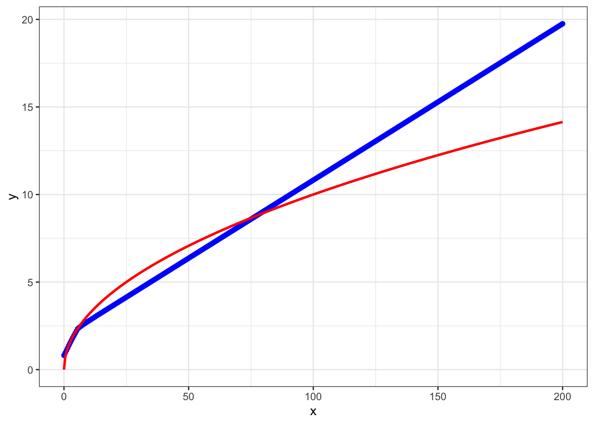

Okay, so it's not particularly good. However, we didn't use a large training set and there are a few things we can do to try to optimise the network. Another important point is that we didn't use the *best* network for prediction (the one with the best validation set error). By default when we call prediction functions we tend to use whatever the final network was during our training: if we ran for $10$ epochs, it would be the network we had at the end of epoch $10$. We can add a callback to save the best model, which would then look something like:


```r
model <- keras_model_sequential() %>% 
  layer_dense(input_shape = c(1),units = 100, activation = "relu") %>% 
  layer_dense(units = 120, activation = "relu") %>% 
  layer_dense(1, activation = "linear")

model %>% compile(loss = "mse", optimizer = "adam", metrics = "mse")

cp_callback <- callback_model_checkpoint(filepath = 'data/RickandMorty/data/models/densemodel.h5', save_weights_only = FALSE, mode = "auto",  monitor = "val_mse", verbose = 0)


tensorflow::set_random_seed(42)
model %>% fit(x = trainingX, y = trainingY, validation_data = list(testingX, testingY), epochs = 100, verbose = 0,  callbacks = list(cp_callback))
```

This optimised model can be loaded in and used for prediction:


```r
model = load_model_hdf5('data/RickandMorty/data/models/densemodel.h5')
xstar <- seq(0,200,by=0.5)
forecastY <- model %>% predict(xstar)
ggplot(data.frame(x=xstar,y=forecastY ), aes(x = x, y = y)) + geom_line(size = 1) + geom_point(color='blue') +
geom_line(color='red',size = 1, data = data.frame(x=xstar,y=sqrt(xstar)), aes(x=x, y=y)) + theme_bw()
```

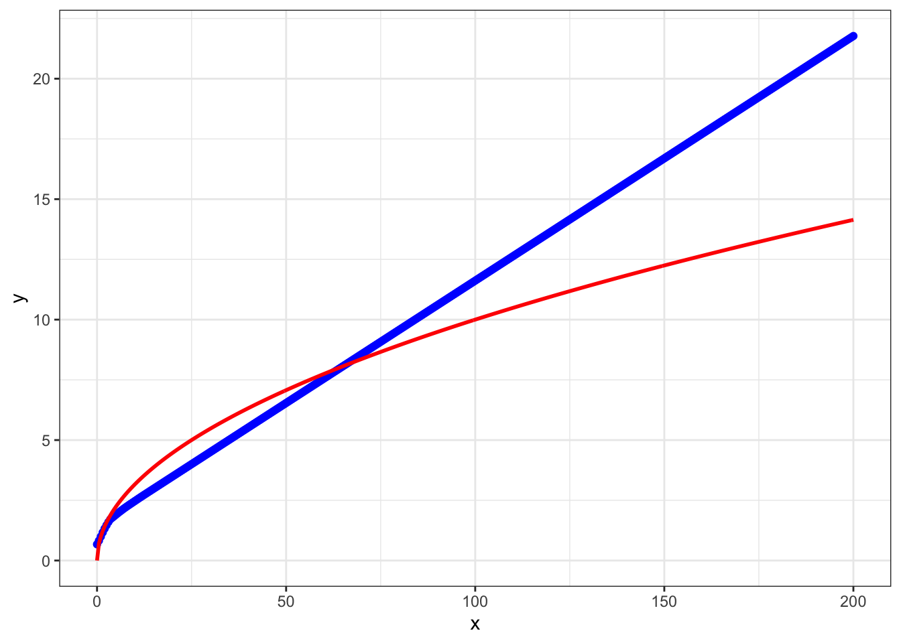

We can try varying a few other aspects of the network to get an idea of how NNs behave. For example, first try increasing the training set size. Try adding or removing layers, and varying layer widths. Another thing thing that can be varied is the final layer activation. The [keras manual](https://keras.io/api/layers/activations/) should provide a useful resource to explore what options are available.  

In the snippet of code below we use a comparatively large dataset, with the input data generated in the region $[0,80]$ and $[120,200]$. By ensuring there is no input data generated in the range $(80,120)$ it is much easier to see if the moodel is extrapolating over locations with no data. 


```r
tdims <- 5000 #Number of samples to generate

trainingX  <- array(0, dim=c(tdims,1)) #Store data as an array (required by Keras)
trainingX[1:tdims,1] <-  c( runif(tdims/2, min=0, max=80),  runif(tdims/2, min=120, max=200) )
trainingY  <- array(0, dim=c(tdims,1))
trainingY[1:tdims,1] <- sqrt(trainingX[1:tdims,1])

#Now do the same but for a independently generated test set
testingX  <- array(0, dim=c(tdims,1)) #Store as arrays
testingX[1:tdims,1] <- runif(tdims, min=0, max=200)
testingY  <- array(0, dim=c(tdims,1))
testingY[1:tdims,1] <- sqrt(testingX[1:tdims,1])


model <- keras_model_sequential() %>% 
  layer_flatten(input_shape = c(1)) %>% 
  layer_dense(units = 10, activation = "relu") %>% 
  layer_dense(units = 20, activation = "relu") %>% 
  layer_dense(1, activation = "linear")

model %>% compile(loss = "mse", optimizer = "adam", metrics = "mse")

cp_callback <- callback_model_checkpoint(filepath = 'data/RickandMorty/data/models/densemodel.h5', save_weights_only = FALSE, mode = "auto",  monitor = "val_mse", verbose = 0)


tensorflow::set_random_seed(42)
model %>% fit(x = trainingX, y = trainingY, validation_data = list(testingX, testingY), epochs = 100, verbose = 0,  callbacks = list(cp_callback))

model = load_model_hdf5('data/RickandMorty/data/models/densemodel.h5')
xstar <- seq(0,250,by=0.5)

forecastY <- model %>% predict(xstar)

dataLM <- data.frame(x=trainingX,y=trainingY)
lrfit <- lm(data = dataLM, y~x)
predictedValues<-predict.lm(lrfit, newdata = data.frame(x=xstar) )

ggplot(data.frame(x=xstar,y=forecastY ), aes(x = x, y = y)) + geom_line(size = 1) + geom_point(color='blue') +
geom_line(color='red',size = 1, data = data.frame(x=xstar,y=predictedValues), aes(x=x, y=y)) + 
geom_line(color='green',size = 1, data = data.frame(x=xstar,y=sqrt(xstar)), aes(x=x, y=y)) + theme_bw()
```

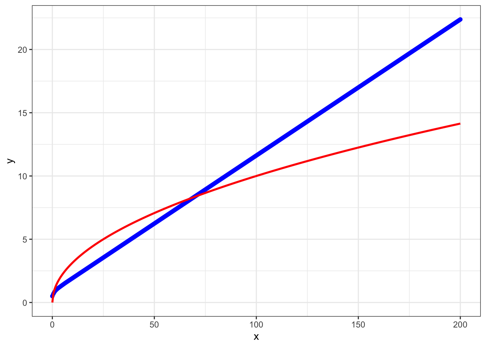

Let's take a closer look over the range where we didn't have any training data:


```r
model = load_model_hdf5('data/RickandMorty/data/models/densemodel.h5')
xstar <- seq(60,140,by=0.5)

forecastY <- model %>% predict(xstar)

dataLM <- data.frame(x=trainingX,y=trainingY)
lrfit <- lm(data = dataLM, y~x)
predictedValues<-predict.lm(lrfit, newdata = data.frame(x=xstar) )

ggplot(data.frame(x=xstar,y=forecastY ), aes(x = x, y = y)) + geom_line(size = 1) + geom_point(color='blue') +
geom_line(color='red',size = 1, data = data.frame(x=xstar,y=predictedValues), aes(x=x, y=y)) + 
geom_line(color='green',size = 1, data = data.frame(x=xstar,y=sqrt(xstar)), aes(x=x, y=y)) + theme_bw()
```

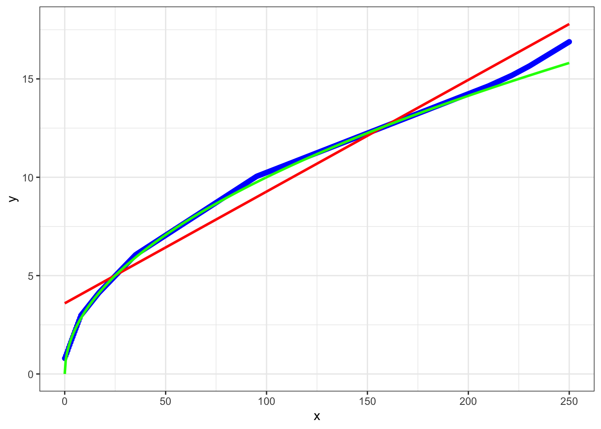

Not perfect, but better than a linear model, at least. So we have a model that has interpolated reasonably well. These types of models are pretty good at inference for a whole range of real world (nonlinear) functions for which there is a sufficient amount of data. 

Excercise 2.1: How could you modify the above code for inferece in a system where we have $5$ input variables and $3$ output variables?


### Image classification with Rick and Morty

We will now try to modify our network for image classification. As with any machine learning application, it's important to have both a question in mind (in this case "can we identify images that contain Rick Sanchez"), and understand the dataset(s) we're using. For training purposes I have downloaded several thousand random images of Rick Sanchez and several thousand images without Rick from the website [Master of All Science](https://masterofallscience.com). The image data can be found in the directory {data/RickandMorty/data/}, which we can load and plot using the {readJPEG} and {grid.raster} functions respectively.


```r
im <- readJPEG("data/RickandMorty/altdata/AllRickImages/Rick_1.jpg")
grid::grid.newpage()
grid.raster(im, interpolate=FALSE, width = 0.5)
```

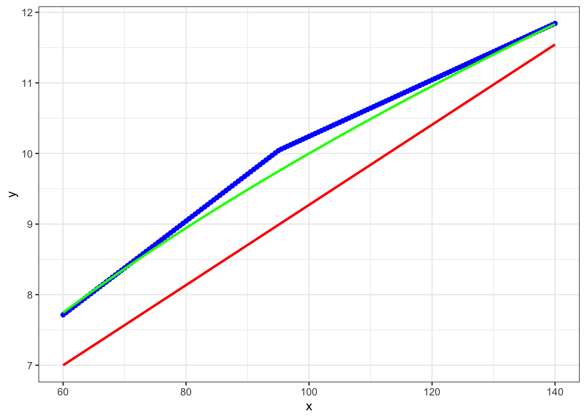

We can use the funciton {dim(im)} to return the image dimensions. In this case each image is stored as a jpeg file, with a $90 \times 160$ pixel resolution with $3$ colour channels (RGB). This loads into R as $160 \times 90 \times 3$ array. We could start by converting the image to grey scale, reducing the dimensions of the input data. However, each channel will potentially carry novel information, so ideally we wish to retain all of the information. You can take a look at what information is present in the different channels by plotting them individually using e.g., {grid.raster(im[,,3], interpolate=FALSE)}. Whilst the difference is not so obvious here, we can imagine sitations where different channels could be dramamtically different, for example, when dealing with remote observation data from satellites, where we might have visible wavelengths alongside infrared and other wavelengths.

Since we plan to retain the channel information, our input data is a tensor of dimension $90 \times 160 \times 3$ i.e., height x width x channels. Note that this ordering is important, as keras expects this ordering (but be careful, as other packages can expect a different ordering).

Before building a neural network we first have to load the data and construct a training, validation, and test set of data. Whilst the package we're using has the ability to specify this on the fly (flow_images_from_directory), for smaller datasets I prefer to manually seperate out training/test/validation sets, as it makes it a little easier debug when things go wrong. 

First load all *Rick* images and all *not Rick* images from their directory. We can get a list of all the *Rick* and *not Rick* images using {list.files}:


```r
files1 <- list.files(path = "data/RickandMorty/altdata/AllRickImages/", pattern = "jpg")
files2 <- list.files(path = "data/RickandMorty/altdata/AllMortyImages/", pattern = "jpg")
```

After loading the files we can see we have $2211$ images of *Rick* and $3046$ images of *not Rick*, for a total of $5257$ imaages. Whilst this is a slight class imbalaance in the dataset (there are more not Rick images than Rick images) it is not dramatically so; in cases where there is extreme imbalance in the number of class observations we may have to do something extra, such as data augmentation, or assinging weights during training.

We next preallocate an empty array to store these training images for the *Rick* and *not Rick* images (an array of dimension $5257 \times 90 \times 160 \times 3$):


```r
allX  <- array(0, dim=c(length(files1)+length(files2),dim(im)[1],dim(im)[2],dim(im)[3]))
```

We can load images using the {readJPEG} function:


```r
for (i in 1:length(files1)){
  allX[i,1:dim(im)[1],1:dim(im)[2],1:dim(im)[3]] <- readJPEG(paste("data/RickandMorty/altdata/AllRickImages/", files1[i], sep=""))
}
```

Similarly, we can load the *not Rick* images and store in the same array:


```r
for (i in 1:length(files2)){
  allX[i+length(files1),1:dim(im)[1],1:dim(im)[2],1:dim(im)[3]] <- readJPEG(paste("data/RickandMorty/altdata/AllMortyImages/", files2[i], sep=""))
}
```

Next we can construct the output variable (usually denoted Y). The nature of this depends on the data itself. In the simplest case we are looking to infer a Rick or not, which is a binary variable, with a zero ($0$) indicating Rick present, annd one ($1$) indicating no Rick (we could always flip this assignment round and have a $1$ for Rick it shouldn't make a difference). The output can therefore be represented as a single (binary) output node. We can construct Y as a vector of length $5257$ containing the classification for each of the images e.g., a $0$ if the image is a *Rick* and $1$ if it is *not Rick*. This is simple enough using the function {rbind}, as we know the first $2211$ images were *Rick* (so create a vector of zeros of length 2211) and the second lot of images are *not Rick* (create a vector of ones of length 3046) and join them together using rbind.


```r
labels <- rbind(matrix(0, length(files1), 1), #These are the Rick laabels
                matrix(1, length(files2), 1)) #These are the not Rick labels
```

Next, we must now split our data in training sets, validation sets, and test sets. In fact I have already stored some seperate "test" set images in another folder that we will load in at the end, so here we only need to seperate images into training and validation sets. It's important to note that we shouldn't simply take the first $N$ images for training with the remainder used for validation/testing, since this may introduce artefacts. For example, here we've loaded in all the *Rick* images in first, with the *not Rick* images loaded in second: if we took, say, the first $2000$ images for training, we would be training with only Rick images, which makes our task impossible, and our algorithm will fail catastrophically.

Although there are more elegant ways to shuffle data using {keras}, here we are going to randomly permute the data, and then take the first $4000$ permuted images for training, with the remainder for validation (Note: it's crucial to permute the $Y$ data in the same way). This gives us a $76%$ to $24%$ split for training to validation data.


```r
set.seed(12345) #Set random number generator for R aspects of the session

vecInd <- seq(1,length(files1)+length(files2)) #A vector of indexes of the length of the data
trainInd <- sample(vecInd)[1:4001] #Permute and take first 4000 training

#Training set
trainX <- allX[trainInd, , , ]
trainY <- labels[trainInd, 1]

#Val set
valX <- allX[-trainInd, , , ]    
valY <- labels[-trainInd, 1]
```

We are almost ready to begin building our neural networks. First we can try a few things to make sure our data has been processed correctly. For example, try manually plotting several of the images and seeing if the labels are correct. Manually print out the image matrix (not a visualisation of it): think about the range of the data, and whether it will need normalising. Finally we can check to see how many of each class is in the training and validation datasets (e.g., sum trainY/testY and compare to the length of trainY/testY). In this case there are $1681$ images of *Rick* and $2320$ images of *not Rick* in the training dataset. Again, whilst there is some slight class inbalance it is not terrible, so we don't need to perform data augmentation or assign weights to the different classes during training. 


### Rick and Morty classifier using Deep Learning

Let us return to our example of image classification. We start by specifying a sequential network as before.


```r
model <- keras_model_sequential() %>% 
```

Our data is slightly different to the usual inputs we've been dealing with: that is, we're not dealing with an input vector, but instead have an array. In this case each image is a $90 \times 160 \time 3$ array. So for our first layer we first have to flatten this down using {flatten}:


```r
model <- keras_model_sequential() %>% 
  layer_flatten(input_shape = c(90,160,3))
```

This should turn our $90 \times \160 \times 3$ input into a $1 \times 43200$ node input. We now add intermediate layers connected to the input layer with rectified linear units ({relu}) as before.


```r
model <- keras_model_sequential() %>% 
  layer_flatten(input_shape = c(90,160,3)) %>% 
  layer_dense(units = 100, activation = "relu") %>% 
  layer_dense(units = 120, activation = "relu")
```

Finally we connect this layer over the final output layer (one neuron) with sigmoid activation:
[activation](https://keras.io/activations/)


```r
layer_flatten(input_shape = c(90,160,3) , activation = 'relu' ) %>%
layer_dense(units = 100)
```

The complete model should look something like:


```r
model <- keras_model_sequential() %>% 
  layer_flatten(input_shape = c(90,160,3)) %>% 
  layer_dense(units = 100, activation = "relu") %>% 
  layer_dense(units = 120, activation = "relu") %>% 
  layer_dense(1, activation = "sigmoid")
```

We can print a summary of the network, for example to see how many parameters it has:


```r
summary(model)
```

In this case we see a total of $4,332,341$ parameters. Yikes, that's a lot of parameters to tune (well not compared some models), and not much data! Next we need to compile and run the model. In this case we need to specify the loss, optimiser, and metrics. Since we are dealing with binary classification, we will use binary cross entropy (binary_crossentropy) and for classification, a good choice of metrics would be {binary_accuracy}. We can compile our model using {keras_compile}:


```r
model %>% compile(loss = "binary_crossentropy", optimizer = "adam", metrics = "binary_accuracy")
```

Finally the model can be fitted to the data. When doing so we additionally need to specify the validation set (if we have one), the batch size and the number of epochs, where an epoch is one forward pass and one backward pass of all the training examples, and the batch size is the number of training examples in one forward/backward pass. You may want to go and get a tea whilst this is running!


```r
set.seed(12345)
model %>% fit(x = trainX, y = trainY, validation_data = list(valX, valY), epochs = 25, verbose = 2)
```

Together with an added callback to save the best model, our code should look something like this:


```r
model <- keras_model_sequential() %>% 
  layer_flatten(input_shape = c(90,160,3)) %>% 
  layer_dense(units = 100, activation = "relu") %>% 
  layer_dense(units = 120, activation = "relu") %>% 
  layer_dense(1, activation = "sigmoid")

model %>% compile(loss = "binary_crossentropy", optimizer = "adam", metrics = "binary_accuracy")

cp_callback <- callback_model_checkpoint(filepath = 'data/RickandMorty/data/models/model_rerun.h5',save_weights_only = FALSE, mode = "auto",  monitor = "val_binary_accuracy", verbose = 0)


tensorflow::set_random_seed(42)
model %>% fit(x = trainX, y = trainY, validation_data = list(valX, valY), epochs = 25, batch_size=500, verbose = 2, callbacks = list(cp_callback))
```

As before we can load a saved model in using the {load_model_hdf5} function and use it for predictions:


```r
model = load_model_hdf5('data/RickandMorty/data/models/model.h5')
```

For this model we achieved an accuracy of above $0.62$ on the validation dataset at epoch $20$ (which had a corresponding accuracy $0.53$ on the training set). Not fantastic when you consider that given the slight imbalance in the number of images in each class, a niave algorithm that always assigns the data to *not Rick* would achieve an accuracy of $0.58$ and $0.57$ in the training and validation sets respectively. It seems like we're getting nowhere fast, and need to change tactic. 

We need to think a little more about what the data actually *is*. In this case we're looking at a set of images. As Rick Sanchez can appear almost anywhere in the image, there's no reason to think that a given input node should correspond in two different images to any useful feature, so it's not surprising that the network did so badly, this is simply a task that a densely connected network is poor at. We need something that can extract out features from the image irregardless of where Rick is. There are approaches build precisely for image analysis that do just this: convolutional neural networks (CNN). 

## Convolutional neural networks

Convolutional neural networks essentially scan across an image and extract out a set of feature representations. These features might then be passed on to a deeper layer (either a convolutional layer or other appropriate layer) which extract out higher order features, as shown in Figure \@ref(fig:covnet). Finally, a densely connected network acts to combine the end features together for prediction, at least in an idealised description of what's going on.

<div class="figure" style="text-align: center">

<p class="caption">(\#fig:covnet)Example of a multilayer convolutional neural network</p>
</div>

In keras we can add a 2D convolutional layer using {layer_conv_2d}. A multilayer convolutional neural network might look something like:


```r
model <- keras_model_sequential() %>%
layer_conv_2d(input_shape = list(90,160,3), filters = 20, kernel_size = c(5,5))
```

which will construct $20$ feature maps (using a kernel of size $5 \times 5$). A $2 \times 2$ max-pool layer would then be added to condense down the feature representations:


```r
model <- keras_model_sequential() %>%
layer_conv_2d(input_shape = list(90,160,3), filters = 20, kernel_size = c(5,5)) %>%
layer_activation("relu") %>%
layer_max_pooling_2d(pool_size=c(2,2))
```

In this case, by default the max-pooling slides one pixel at a time across the image, but we can set the max-pooling to take bigger steps by setting the {strides} option. A complete example model is shown below:


```r
model <- keras_model_sequential() %>%
  layer_conv_2d(input_shape = list(90,160,3), filters = 20, kernel_size = c(5,5)) %>%
  layer_activation("relu") %>%
  layer_max_pooling_2d(pool_size=c(2,2)) %>%
  layer_conv_2d(filters = 20, kernel_size = c(5,5)) %>%
  layer_activation("relu") %>%
  layer_max_pooling_2d(pool_size=c(2,2)) %>%
  layer_conv_2d(filters = 64, kernel_size = c(5,5)) %>%
  layer_activation("relu") %>%
  layer_max_pooling_2d(pool_size=c(2,2)) %>%
  layer_flatten( ) %>%
  layer_dense(units=100) %>%
  layer_dropout(rate = 0.3) %>%
  layer_dense(units=1, activation = "sigmoid")

cp_callback <- callback_model_checkpoint(filepath = 'data/RickandMorty/data/models/modelCNN_rerun.h5',save_weights_only = FALSE, mode = "auto",  monitor = "val_binary_accuracy", verbose = 0)

model %>% compile(loss = "binary_crossentropy", optimizer = "adam", metrics = "binary_accuracy")

tensorflow::set_random_seed(42)
model %>% fit(x = trainX, y = trainY, validation_data = list(valX, valY), epochs = 5, batch_size=100, verbose = 2, callbacks = list(cp_callback))
```

Here we only ran the model for $5$ epochs just to get an feel for it. If we did have time to run this model longer, we would see much better accuracy. We have an accuracy of $0.88$ on the validation dataset at epoch $43$, with a training accuracy of $0.995$. Whilst this is still not great (compared to how well a human could do on a similar task), it's accurate enough to begin making predictions and visualising the results. Fortunately I've already run (and saved) this model for $50$ epochs, so let's load it in for predictions:


```r
model = load_model_hdf5('data/RickandMorty/data/models/modelCNN.h5')
```

We can use this model to make predictions for images not present in either the training or validation datasets. We load in the new set of images, which can be found in the {predictions} subfolder:


```r
files <- list.files(path = "data/RickandMorty/data/predictions/",pattern = "jpg")
predictX  <- array(0,dim=c(length(files),90,160,3))
for (i in 1:length(files)){
  x <- readJPEG(paste("data/RickandMorty/data/predictions/", files[i],sep=""))
  predictX[i,1:90,1:160,1:3] <- x[1:90,1:160,1:3]
}
```

A hard classification can be assigned using the {predict_classes} function, whilst the actual probability of assignment to either class can be evaluated using {predict} (this can be useful for images that might be ambiguous).


```r
probY <- model %>% predict(predictX) #Probability of it being class 1 i,e., a not Rick (1-this for prob of a Rick)
predictY <- as.numeric(probY>0.5) #Hard assignment at p=0.5, a 1 if not Rick, and 0 if Rick
```

We can plot an example:


```r
choice = 13
grid::grid.newpage()
if (predictY[choice]==1) {
  grid.raster(predictX[choice,1:90,1:160,1:3], interpolate=FALSE)
  grid.text(label='Not Rick',x = 0.4, y = 0.77,just = c("left", "top"), gp=gpar(fontsize=15, col="black"))
} else {
  grid.raster(predictX[choice,1:90,1:160,1:3], interpolate=FALSE)
  grid.text(label='Rick',x = 0.4, y = 0.77,just = c("left", "top"), gp=gpar(fontsize=25, col="black"))
}
```

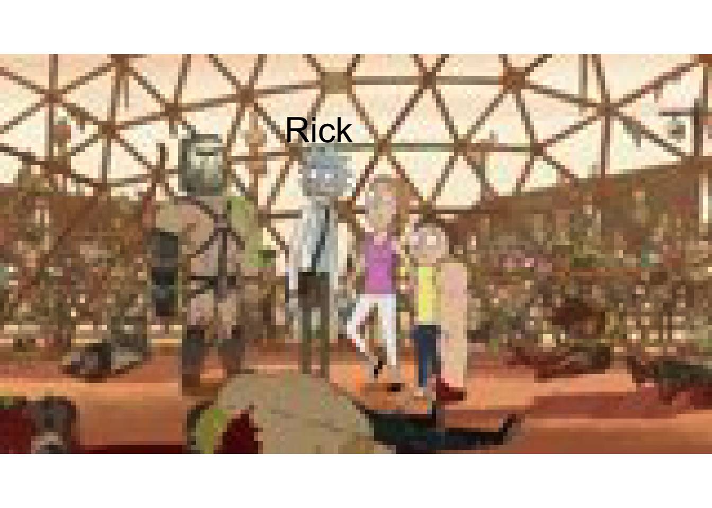


```r
choice = 1
grid::grid.newpage()
if (predictY[choice]==1) {
  grid.raster(predictX[choice,1:90,1:160,1:3], interpolate=FALSE)
  grid.text(label='Not Rick',x = 0.4, y = 0.77,just = c("left", "top"), gp=gpar(fontsize=25, col="white"))
} else {
  grid.raster(predictX[choice,1:90,1:160,1:3], interpolate=FALSE)
  grid.text(label='Rick',x = 0.4, y = 0.77,just = c("left", "top"), gp=gpar(fontsize=15, col="black"))
}
```


```r
choice = 6
grid::grid.newpage()
if (predictY[choice]==1) {
  grid.raster(predictX[choice,1:90,1:160,1:3], interpolate=FALSE)
  grid.text(label='Not Rick',x = 0.4, y = 0.77,just = c("left", "top"), gp=gpar(fontsize=25, col="black"))
} else {
  grid.raster(predictX[choice,1:90,1:160,1:3], interpolate=FALSE)
  grid.text(label='Rick',x = 0.4, y = 0.77,just = c("left", "top"), gp=gpar(fontsize=25, col="white"))
}
```

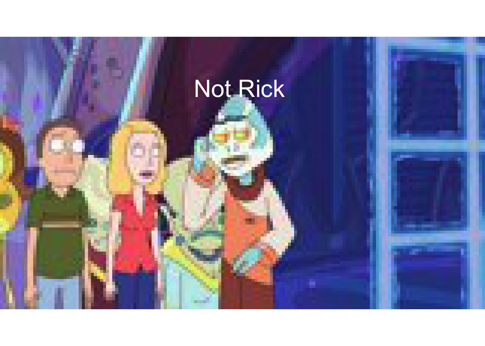


```r
grid::grid.newpage()
choice = 16
if (predictY[choice]==1) {
  grid.raster(predictX[choice,1:90,1:160,1:3], interpolate=FALSE)
  grid.text(label='Not Rick: Must be a Jerry',x = 0.4, y = 0.77,just = c("left", "top"), gp=gpar(fontsize=15, col="white"))
} else {
  grid.raster(predictX[choice,1:90,1:160,1:3], interpolate=FALSE)
  grid.text(label='Rick',x = 0.2, y = 0.77,just = c("left", "top"), gp=gpar(fontsize=15, col="white"))
}
```

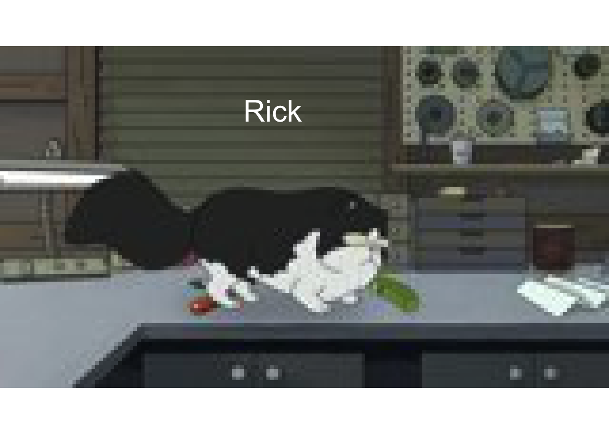


### Checking the models

Although our model seems to be doing reasonably well, it always helps to see where things are going wrong. Let's take a look at a few of the false positives and a few of the false negatives.


```r
probvalY <-  model %>%  predict(valX)
predictvalY <-as.numeric(probvalY>0.5)

TP <- which(predictvalY==1 & valY==1)
FN <- which(predictvalY==0 & valY==1)
TN <- which(predictvalY==0 & valY==0)
FP <- which(predictvalY==1 & valY==0)
```

Let's see where we got it right. These were all predicted as not Rick, and the images did not contain a Rick:


```r
grid::grid.newpage()
grid.raster(valX[TP[1],1:90,1:160,1:3], interpolate=FALSE, width = 0.3, x = 0.5, y=0.2)
grid.raster(valX[TP[2],1:90,1:160,1:3], interpolate=FALSE, width = 0.3, x = 0.5, y=0.5)
grid.raster(valX[TP[3],1:90,1:160,1:3], interpolate=FALSE, width = 0.3, x = 0.5, y=0.8)
```


And these were all predicted as Rick and the image contained a Rick:


```r
grid::grid.newpage()
grid.raster(valX[TN[1],1:90,1:160,1:3], interpolate=FALSE, width = 0.3, x = 0.5, y=0.2)
grid.raster(valX[TN[2],1:90,1:160,1:3], interpolate=FALSE, width = 0.3, x = 0.5, y=0.5)
grid.raster(valX[TN[3],1:90,1:160,1:3], interpolate=FALSE, width = 0.3, x = 0.5, y=0.8)
```

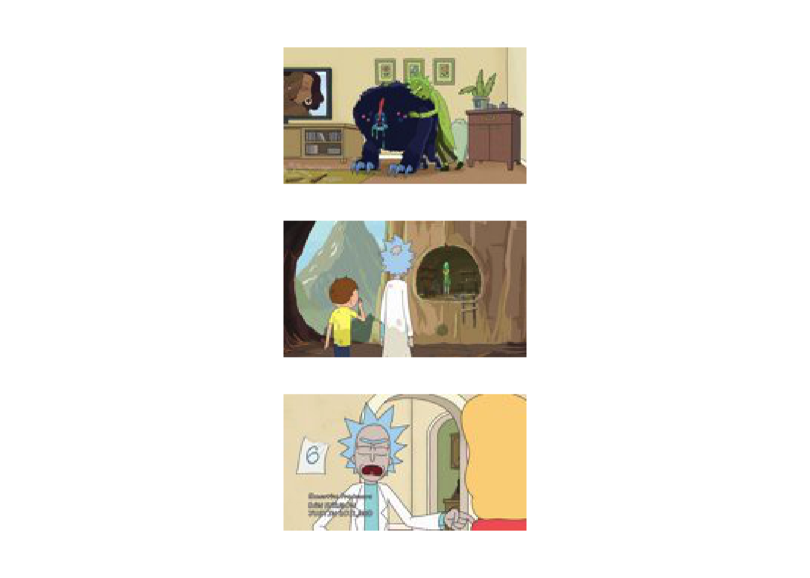

And these we got wrong (predicted Rick, but he was't there):


```r
grid::grid.newpage()
grid.raster(valX[FN[1],1:90,1:160,1:3], interpolate=FALSE, width = 0.3, x = 0.5, y=0.2)
grid.raster(valX[FN[2],1:90,1:160,1:3], interpolate=FALSE, width = 0.3, x = 0.5, y=0.5)
grid.raster(valX[FN[3],1:90,1:160,1:3], interpolate=FALSE, width = 0.3, x = 0.5, y=0.8)
```

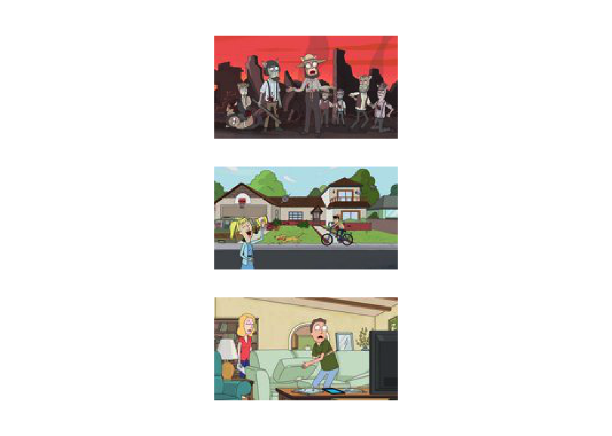

Or predicted not Rick, but he was in the image:


```r
grid::grid.newpage()
grid.raster(valX[FP[1],1:90,1:160,1:3], interpolate=FALSE, width = 0.3, x = 0.5, y=0.2)
grid.raster(valX[FP[2],1:90,1:160,1:3], interpolate=FALSE, width = 0.3, x = 0.5, y=0.5)
grid.raster(valX[FP[4],1:90,1:160,1:3], interpolate=FALSE, width = 0.3, x = 0.5, y=0.8)
```


Whilst visualising the data is often helpful, in this case it's not entirely clear why the network is failing in some of these cases. An alternative way to look at what's going wrong is a look at which pixels are contributing the most to the classifier, as we highligted in the lecture. We will return to this shortly.

## Multiclass prediction

In the previous section we dealt with predicting a Rick (0) or a not Rick (1). This is because we framed our goal as a simple binary question: an image either has a Rick in or it doesn't. Given the nature of the data, there are other possible questions we might be interested in: for example, does the image contain another character, such as Morty? A given image could both a Rick and a Morty, one or the other, or neither. We cold therefore frame our interst as two binary questions: "does the image contain a Rick?" and  "does the image contain a Morty?" requiring two output nodes. I have already processed the invidual images into seperate folders, one folder containing only Rick, one containing only Morty, one containing both in the same image, and one containing neither. These can be read in:


```r
files1 <- list.files(path = "data/RickandMorty/data/ThreeClassModel/AllRickImages/", pattern = "jpg") #These contain Rick but not Morty
files2 <- list.files(path = "data/RickandMorty/data/ThreeClassModel/AllMortyImages/", pattern = "jpg") #These contai Morty but not Rick
files3 <- list.files(path = "data/RickandMorty/data/ThreeClassModel/Both/", pattern = "jpg") #These contain both Rick and Morty
files4 <- list.files(path = "data/RickandMorty/data/ThreeClassModel/Neither/", pattern = "jpg") #These contain neither

allX  <- array(0, dim=c(length(files1)+length(files2)+length(files3)+length(files4),dim(im)[1],dim(im)[2],dim(im)[3]))

for (i in 1:length(files1)){
  allX[i,1:dim(im)[1],1:dim(im)[2],1:dim(im)[3]] <- readJPEG(paste("data/RickandMorty/data/ThreeClassModel/AllRickImages/", files1[i], sep=""))
}

for (i in 1:length(files2)){
  allX[i+length(files1),1:dim(im)[1],1:dim(im)[2],1:dim(im)[3]] <- readJPEG(paste("data/RickandMorty/data/ThreeClassModel/AllMortyImages/", files2[i], sep=""))
}

for (i in 1:length(files3)){
  allX[i+length(files1)+length(files2),1:dim(im)[1],1:dim(im)[2],1:dim(im)[3]] <- readJPEG(paste("data/RickandMorty/data/ThreeClassModel/Both/", files3[i], sep=""))
}

for (i in 1:length(files4)){
  allX[i+length(files1)+length(files2)+length(files3),1:dim(im)[1],1:dim(im)[2],1:dim(im)[3]] <- readJPEG(paste("data/RickandMorty/data/ThreeClassModel/Neither/", files4[i], sep=""))
}
```

As before we can costruct the output variable: a two dimensional output with $[1,0]$ indicating Rick, $[0,1]$ and Morty, $[1,1]$ indicating both, and $[0,0]$ neither.


```r
labels <- rbind(
  t(t(rep(1, length(files1)))) %*% c(1,0),
  t(t(rep(1, length(files2)))) %*% c(0,1),
  t(t(rep(1, length(files3)))) %*% c(1,1),
  t(t(rep(1, length(files4)))) %*% c(0,0)
  )
```

In total there are $2213$ Ricks, and $2158$ Mortys. We can split this data for training/validation as before:


```r
set.seed(12345) #Set random number generator for R aspects of the session

vecInd <- seq(1,length(files1)+length(files2)+length(files3)+length(files4)) #A vector of indexes
trainInd <- sample(vecInd)[1:4001] #Permute and take first 4000 training
#Train
trainX <- allX[trainInd, , , ]
trainY <- labels[trainInd, ]
#Val
valX <- allX[-trainInd, , , ]     
valY <- labels[-trainInd, ]
```

And we can perform inference similarly to before, with the only real difference that we now have two output nodes with sigmoid activation: one asking is there a Rick, one asking is there a Morty.


```r
model <- keras_model_sequential() %>%
  layer_conv_2d(input_shape = list(90,160,3), filters = 20, kernel_size = c(5,5)) %>%
  layer_activation("relu") %>%
  layer_max_pooling_2d(pool_size=c(2,2)) %>%
  layer_conv_2d(filters = 20, kernel_size = c(5,5)) %>%
  layer_activation("relu") %>%
  layer_max_pooling_2d(pool_size=c(2,2)) %>%
  layer_conv_2d(filters = 64, kernel_size = c(5,5)) %>%
  layer_activation("relu") %>%
  layer_max_pooling_2d(pool_size=c(2,2)) %>%
  layer_flatten( ) %>%
  layer_dense(units=100) %>%
  layer_dropout(rate = 0.3) %>%
  layer_dense(units=2, activation = "sigmoid")

cp_callback <- callback_model_checkpoint(filepath = 'data/RickandMorty/data/models/modelCNNMultClass_rerun.h5',save_weights_only = FALSE, mode = "auto",  monitor = "val_binary_accuracy", verbose = 0)

model %>% compile(loss = "binary_crossentropy", optimizer = "adam", metrics = "binary_accuracy")

tensorflow::set_random_seed(42)
model %>% fit(x = trainX, y = trainY, validation_data = list(valX, valY), epochs = 5, batch_size=100, verbose = 2, callbacks = list(cp_callback))
```

### Categorical data

In the previous example we were using a binary classification since we were only concerned if an the image contained a Rick or not (or by extension if a Morty or not). A more general case is categorical classification (of which binary is a special case) where we have $P$ mutually exclusive classes, and wish to infer which one of those $P$-classes is in a particular image. In this case we might want to infer Rick, Morty, or neither, so a three class system. Note that since we are framing this as exclusive question, we shoudn't really use any data with both Rick and Morty in.


```r
allX  <- array(0, dim=c(length(files1)+length(files2)+length(files4),dim(im)[1],dim(im)[2],dim(im)[3]))

for (i in 1:length(files1)){
  allX[i,1:dim(im)[1],1:dim(im)[2],1:dim(im)[3]] <- readJPEG(paste("data/RickandMorty/data/ThreeClassModel/AllRickImages/", files1[i], sep=""))
}

for (i in 1:length(files2)){
  allX[i+length(files1),1:dim(im)[1],1:dim(im)[2],1:dim(im)[3]] <- readJPEG(paste("data/RickandMorty/data/ThreeClassModel/AllMortyImages/", files2[i], sep=""))
}

for (i in 1:length(files4)){
  allX[i+length(files1)+length(files2),1:dim(im)[1],1:dim(im)[2],1:dim(im)[3]] <- readJPEG(paste("data/RickandMorty/data/ThreeClassModel/Neither/", files4[i], sep=""))
}
```

When using categorical data (Rick/Morty/Neither) we could instead represent this as a number or factor (1/2/3). This type of representation is still hard to use directly, and a much better represetation is via one-hot encoding, that is for each output we have vector of length $P$ with zeros everywhere exept the column represeting a particular class. So in our Rick, Morty, Neither system a Rick is $[1,0,0]$, and Morty is $[0,1,0]$, and Neither is $[0,0,1]$. Given a list of observations from a $P$-class system we can one-hot encode using the {to_catogrical} function. In the snippet of code below we do this manually:


```r
labels <- rbind(
  t(t(rep(1, length(files1)))) %*% c(1,0,0),
  t(t(rep(1, length(files2)))) %*% c(0,1,0),
  t(t(rep(1, length(files4)))) %*% c(0,0,1)
  )
```

In this particular case we have a slight class imbalace with $913$ Ricks, $858$ Mortys, and $2186$ containing neither Rick nor Morty. As previously, we can construct a train/validation set:


```r
set.seed(12345) #Set random number generator for R aspects of the session

vecInd <- seq(1,length(files1)+length(files2)+length(files4)) #A vector of indexes
trainInd <- sample(vecInd)[1:3001] #Permute and take first 4000 training

#Train
trainX <- allX[trainInd, , , ]
trainY <- labels[trainInd, ]

#Val
valX <- allX[-trainInd, , , ]    
valY <- labels[-trainInd, ]
```

And finally we run the code. Here we must make sure to use the appropriate activation funtion on the final layer and correct loss function/metrics:


```r
model <- keras_model_sequential() %>%
  layer_conv_2d(input_shape = list(90,160,3), filters = 20, kernel_size = c(5,5)) %>%
  layer_activation("relu") %>%
  layer_max_pooling_2d(pool_size=c(2,2)) %>%
  layer_conv_2d(filters = 20, kernel_size = c(5,5)) %>%
  layer_activation("relu") %>%
  layer_max_pooling_2d(pool_size=c(2,2)) %>%
  layer_conv_2d(filters = 64, kernel_size = c(5,5)) %>%
  layer_activation("relu") %>%
  layer_max_pooling_2d(pool_size=c(2,2)) %>%
  layer_flatten( ) %>%
  layer_dense(units=100) %>%
  layer_dropout(rate = 0.3) %>%
  layer_dense(units=3, activation = "softmax")

cp_callback <- callback_model_checkpoint(filepath = 'data/RickandMorty/data/models/modelCNNCat_rerun.h5',save_weights_only = FALSE, mode = "auto",  monitor = "val_categorical_accuracy", verbose = 0)

model %>% compile(loss = "categorical_crossentropy", optimizer = "adam", metrics = "categorical_accuracy")

tensorflow::set_random_seed(42)
model %>% fit(x = trainX, y = trainY, validation_data = list(valX, valY), epochs = 5, batch_size=100, verbose = 2, callbacks = list(cp_callback))
```

Note that if we were specifically interested, we could set out to address the class weights using the {class_weights} argument in the model fitting step. In this case class $3$ has almost $3$ times more$1$ and $2$, so we want to upweight the underepresented classes by this amount:


```r
model %>% fit(x = trainX, y = trainY, validation_data = list(valX, valY), class_weight = list("0"=3,"1"=3,"2"=1), epochs = 5, batch_size=100, verbose = 2, callbacks = list(cp_callback))
```

I have already run this model for $50$ epochs (without adjusting for class imbalance) and saved as a .h5 model. Let's take a quick look at this model for prediction:


```r
model = load_model_hdf5('data/RickandMorty/data/models/modelCNNCat.h5')

probvalY <-  model %>%  predict(valX)

#Find the instances where we the Rick probabilty is maximum and the image is a Rick:
RickTP <- which( (probvalY[,1]>probvalY[,2]) & (probvalY[,1]>probvalY[,3]) & valY[,1]==1 )
#Find the instances where we the Morty probabilty is maximum and the image is a Morty:
MortyTP <- which( (probvalY[,2]>probvalY[,1]) & (probvalY[,2]>probvalY[,3]) & valY[,2]==1 )
```

Let's plot them, for Rick:


```r
grid::grid.newpage()
grid.raster(valX[RickTP[1],1:90,1:160,1:3], interpolate=FALSE, width = 0.3, x = 0.5, y=0.2)
grid.raster(valX[RickTP[2],1:90,1:160,1:3], interpolate=FALSE, width = 0.3, x = 0.5, y=0.5)
grid.raster(valX[RickTP[3],1:90,1:160,1:3], interpolate=FALSE, width = 0.3, x = 0.5, y=0.8)
```

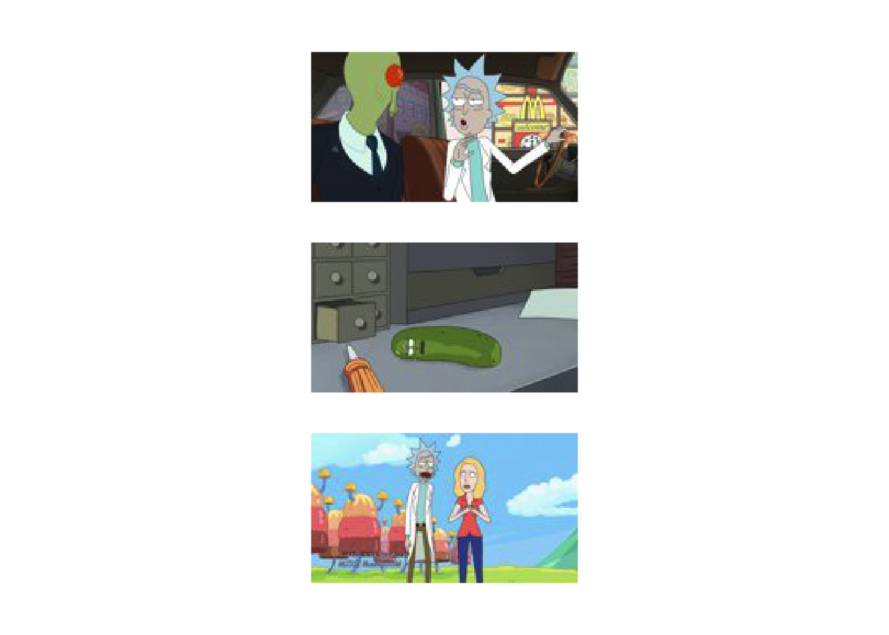

And for Morty:


```r
grid::grid.newpage()
grid.raster(valX[MortyTP[1],1:90,1:160,1:3], interpolate=FALSE, width = 0.3, x = 0.5, y=0.2)
grid.raster(valX[MortyTP[2],1:90,1:160,1:3], interpolate=FALSE, width = 0.3, x = 0.5, y=0.5)
grid.raster(valX[MortyTP[3],1:90,1:160,1:3], interpolate=FALSE, width = 0.3, x = 0.5, y=0.8)
```

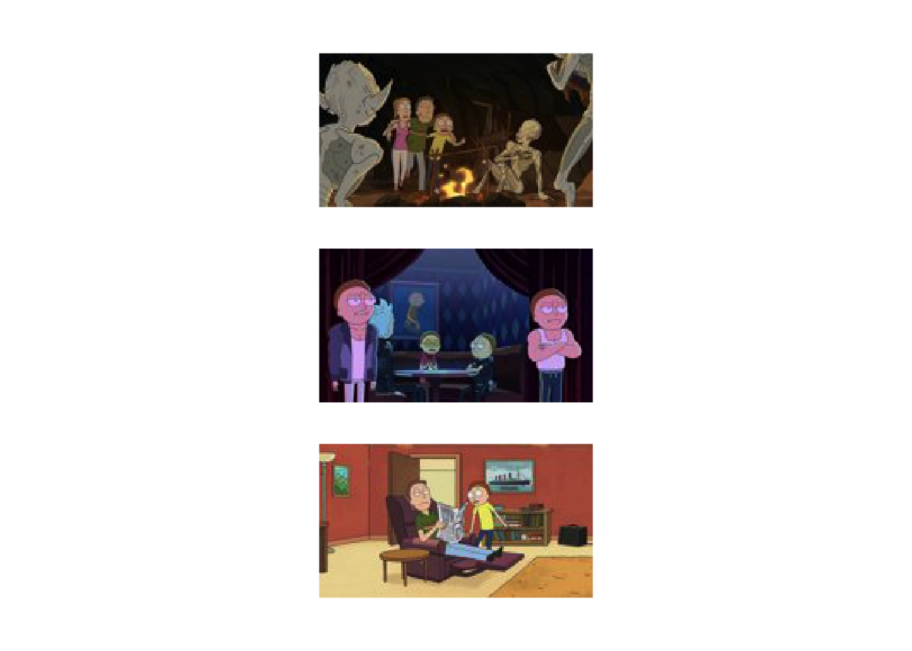

### Intepreting CNN

For these types of tasks, and besides the increaase performence, a key advantage of CNNs over densely connected networks lies in the increased interpretability. For example, for an optimised model and any given image we could take a look the feature representations at intermediate layers. In the snippet of code below, adapted from [this tutorial](https://rstudio-conf-2020.github.io/dl-keras-tf/notebooks/visualizing-what-cnns-learn.nb.html) (which itself builds on [this work](https://blog.keras.io/how-convolutional-neural-networks-see-the-world.html)) we will take an example image and look at the activations in the first layer of the network: that is, we get a glimpse as to how the filters have processed a specific image. 


```r
model = load_model_hdf5('data/RickandMorty/data/models/modelCNNCat.h5')

tf$compat$v1$disable_eager_execution()

layer_outputs <- lapply(model$layers[1:8], function(layer) layer$output)
activation_model <- keras_model(inputs = model$input, outputs = layer_outputs)

#Choice here is just an index for a given image. So here we just look at the 1st TP Rick image in the validation set
choice = 1
activations <- activation_model %>% predict( array_reshape( valX[RickTP[choice],1:90,1:160,1:3] , c(1,90, 160, 3) ) )
first_layer_activation <- activations[[1]]
```

Recall that the first layer is an array of size $86 \times 156 \times 20$. That is, 20 different feature representations of $86 \times 146$ (we can check the expected size of individual layers by looking at the model summary). Our output here should be the same as this. We will visualise some of these $20$ feature representations (alongside the image itself). First the image:


```r
grid::grid.newpage()
grid.raster( valX[RickTP[choice],1:90,1:160,1:3] , interpolate=FALSE, width = 0.3, x = 0.5, y=0.2)
```

And now the feature maps $1,2,3,4,5,10,12,15$ and $20$ (note the code is a little extra below, since the feature representations need to be rotated).


```r
op <- par(mfrow=c(3,3))
image(t(first_layer_activation[1,,,1])[,ncol(t(first_layer_activation[1,,,1])):1], axes = FALSE )
image(t(first_layer_activation[1,,,2])[,ncol(t(first_layer_activation[1,,,2])):1], axes = FALSE )
image(t(first_layer_activation[1,,,3])[,ncol(t(first_layer_activation[1,,,3])):1], axes = FALSE )
image(t(first_layer_activation[1,,,4])[,ncol(t(first_layer_activation[1,,,4])):1], axes = FALSE )
image(t(first_layer_activation[1,,,5])[,ncol(t(first_layer_activation[1,,,5])):1], axes = FALSE )
image(t(first_layer_activation[1,,,10])[,ncol(t(first_layer_activation[1,,,10])):1], axes = FALSE )
image(t(first_layer_activation[1,,,12])[,ncol(t(first_layer_activation[1,,,12])):1], axes = FALSE )
image(t(first_layer_activation[1,,,15])[,ncol(t(first_layer_activation[1,,,15])):1], axes = FALSE )
image(t(first_layer_activation[1,,,20])[,ncol(t(first_layer_activation[1,,,20])):1], axes = FALSE )
par(op)
```

We can see from these representations a general similarity to the original plot, but certain parts have been emphasized. We could similarly take a look at the feature representations deeper in the network:


```r
image_width <- 56
images_per_row <- 5

i <- 7
  
layer_activation <- activations[[i]]
layer_name <- model$layers[[i]]$name
 
n_features <- dim(layer_activation)[[4]]
n_cols <- n_features %/% images_per_row
 
op <- par(mfrow = c(n_cols, images_per_row), mai = rep_len(0.02, 4))
  
for (col in 0:(n_cols - 1)) {
  for (row in 0:(images_per_row - 1)) {
      channel_image <- layer_activation[1,,,(col*images_per_row) + row + 1]
      image(t(channel_image)[,ncol(t(channel_image)):1], axes = FALSE,)
  }
}
  
par(op)
```

At higher layers, the features have become far less recognisable and now, and represent specific features that can be built up to perform classification.

#### Class activation

Further to visualising the feature represetations, we can also begin to visualise how particular regions activate to a particular class i.e., identify what pixels the CNN is concentrating on when looking classifying an image as Rick.


```r
choice <- 7

X0 <- readJPEG(paste("data/RickandMorty/data/ThreeClassModel/AllRickImages/", files1[choice], sep=""))
imag_pred <- array_reshape(X0[1:90,1:160,1:3] , c(1, 90, 160, 3) )

predict(model, imag_pred)

# Prediction vector, in this case class 1 is Rick
d_output <- model$output[, 1]

#The last convolutional layer (you will need to know what this layer is called for your network, which can be done by looking at the model summary. In this case, because you're using my precalculated network there is no need to change things)
last_conv_layer <- model %>% get_layer("conv2d_20")

# This is the gradient of the "Rick" class with respect to the output feature map of `conv2d_20`
grads <- k_gradients(d_output, last_conv_layer$output)[[1]]
pooled_grads <- k_mean(grads, axis = c(1, 2, 3))

#Function to access the values of `pooled_grads` and output feature map of `conv2d_20`, given a sample image
iterate <- k_function(list(model$input),list(pooled_grads, last_conv_layer$output[1,,,]))
c(pooled_grads_value, conv_layer_output_value) %<-% iterate(list( imag_pred  ))

#Multiply each channel in the feature map array by "how important this channel is" with regard to the Rick class
for (i in 1:64) {
  conv_layer_output_value[,,i] <- conv_layer_output_value[,,i] * pooled_grads_value[[i]] 
}

#Channel-wise mean of the resulting feature map is our heatmap of class activation
heatmap <- apply(conv_layer_output_value, c(1,2), mean)

#A whole lot of plotting:

heatmap <- pmax(heatmap, 0) 
heatmap <- heatmap / max(heatmap)
write_heatmap <- function(heatmap, filename, width = 150, height = 150,bg = "white", col = terrain.colors(12)) {
  png(filename, width = width, height = height, bg = bg)
  op = par(mar = c(0,0,0,0))
  on.exit({par(op); dev.off()}, add = TRUE)
  rotate <- function(x) t(apply(x, 2, rev))
  image(rotate(heatmap), axes = FALSE, asp = 1, col = col)
}
write_heatmap(heatmap, "data/RickandMorty/RM_heatmap.png") 

library(magick) 
library(viridis) 

image <- image_read(paste("data/RickandMorty/data/ThreeClassModel/AllRickImages/", files1[choice], sep=""))
info <- image_info(image) 
geometry <- sprintf("%dx%d!", info$width, info$height) 
pal <- col2rgb(viridis(20), alpha = TRUE) 
alpha <- floor(seq(0, 255, length = ncol(pal))) 
pal_col <- rgb(t(pal), alpha = alpha, maxColorValue = 255)
write_heatmap(heatmap, "data/RickandMorty/RM_overlay.png", width = 14, height = 14, bg = NA, col = pal_col) 
# Overlay the heatmap
image_read("data/RickandMorty/RM_overlay.png") %>% 
  image_resize(geometry, filter = "quadratic") %>% 
  image_composite(image, operator = "blend", compose_args = "20") %>%
  plot() 
```

We can have a look at where the CNN focuses on a set of Morty images.


```r
choice <- 30

X0 <- readJPEG(paste("data/RickandMorty/data/ThreeClassModel/AllMortyImages/", files2[choice], sep=""))
imag_pred <- array_reshape(X0[1:90,1:160,1:3] , c(1, 90, 160, 3) )

predict(model, imag_pred)
d_output <- model$output[, 2]
last_conv_layer <- model %>% get_layer("conv2d_20")
grads <- k_gradients(d_output, last_conv_layer$output)[[1]]
pooled_grads <- k_mean(grads, axis = c(1, 2, 3))
iterate <- k_function(list(model$input),list(pooled_grads, last_conv_layer$output[1,,,]))
c(pooled_grads_value, conv_layer_output_value) %<-% iterate(list( imag_pred  ))

for (i in 1:64) {
  conv_layer_output_value[,,i] <- conv_layer_output_value[,,i] * pooled_grads_value[[i]] 
}

heatmap <- apply(conv_layer_output_value, c(1,2), mean)
heatmap <- pmax(heatmap, 0) 
heatmap <- heatmap / max(heatmap)
write_heatmap <- function(heatmap, filename, width = 150, height = 150, bg = "white", col = terrain.colors(12)) {
  png(filename, width = width, height = height, bg = bg)
  op = par(mar = c(0,0,0,0))
  on.exit({par(op); dev.off()}, add = TRUE)
  rotate <- function(x) t(apply(x, 2, rev))
  image(rotate(heatmap), axes = FALSE, asp = 1, col = col)
}
write_heatmap(heatmap, "data/RickandMorty/RM_heatmap.png") 

library(magick) 
library(viridis) 

image <- image_read(paste("data/RickandMorty/data/ThreeClassModel/AllMortyImages/", files2[choice], sep=""))

info <- image_info(image) 
geometry <- sprintf("%dx%d!", info$width, info$height) 
pal <- col2rgb(viridis(20), alpha = TRUE) 
alpha <- floor(seq(0, 255, length = ncol(pal))) 
pal_col <- rgb(t(pal), alpha = alpha, maxColorValue = 255)
write_heatmap(heatmap, "data/RickandMorty/RM_overlay.png", width = 14, height = 14, bg = NA, col = pal_col) 
image_read("data/RickandMorty/RM_overlay.png") %>% 
  image_resize(geometry, filter = "quadratic") %>% 
  image_composite(image, operator = "blend", compose_args = "20") %>%
  plot() 
```


## CNNs for Motif analysis

Aside from image analyses, CNNs have also bee useful for studying other types of data including genomic data such as DNA-sequence analysis, and DNA-methylation or histone modificaiton data. The use of CNNs for studying regulatory motifs in genomic sequecing data as been reviewed in [[@zhang2022assessing]](https://academic.oup.com/bib/article/23/1/bbab374/6381249). Alhough no longer considered state-of-the art, CNNs for these applications still find practical use, particularly when combined with more recent developments such as recurrent neural networks. 

In the example below we code for a simple CNN which aims to identify if a particular $200$bp genomic region contains a SOX17 or PRDM1 binding site. The data is based on ChIP-sequencig data taken from [[@tang2022sequential]](https://pubmed.ncbi.nlm.nih.gov/35411086/) and is avaible to download at NCBI GEO (GSE159654). Briefly, this dataset consists of ChIP-sequencing indicating the binding of two trascription factors, SOX17 and PRDM1, that play a role in the specification of the germline. Here the work makes use of an in vitro model based on pluripotent stem cells to derived embryonnic precursors of sperm and eggs, the primordial germ cells. For this section, peaks from individual replicates were concatenated and overlapping regions merged using bedtools, and a final list of regions for each TF was generated based on the centre of these peaks plus or minus $100$bp. Regions with both a SOX17 and PRDM1 binding site were excluded. For further comparison a random set of genomic sequences were sampled from the human genome. Finallly, geomic sequencecs associated with human genome hg38 extracted using bedtools getfasta. The processing steps can be found in the file data/ChIP/processdata.sh.

In the sippet of code below we use the Biostrings package to read in the fasta files for SOX17, PRDM1, and random regions. Dealing directly with a sequence string is difficult, so to make inferece easier we first one-hot the sequence s i.e., instead of representing a particular base pair as A, C, G, or T, these will instead be represened as $A \to [1,0,0,0]$, $C \to [0,1,0,0]$, $G \to [0,0,1,0]$, $T \to [0,0,0,1]$. Each basepair will be treated as a seperate "colour channel", and the iput data is a $200 \timmes 4$ array. In total we have $13,065$ sequences for SOX17, $22,255$ for PRDM1, and $21,921$ random regions.


```r
library(Biostrings)
```

```
## Warning: package 'Biostrings' was built under R version 3.5.2
```

```
## Loading required package: BiocGenerics
```

```
## Loading required package: parallel
```

```
## 
## Attaching package: 'BiocGenerics'
```

```
## The following objects are masked from 'package:parallel':
## 
##     clusterApply, clusterApplyLB, clusterCall, clusterEvalQ,
##     clusterExport, clusterMap, parApply, parCapply, parLapply,
##     parLapplyLB, parRapply, parSapply, parSapplyLB
```

```
## The following object is masked from 'package:keras':
## 
##     normalize
```

```
## The following objects are masked from 'package:dplyr':
## 
##     combine, intersect, setdiff, union
```

```
## The following objects are masked from 'package:stats':
## 
##     IQR, mad, sd, var, xtabs
```

```
## The following objects are masked from 'package:base':
## 
##     anyDuplicated, append, as.data.frame, basename, cbind, colMeans,
##     colnames, colSums, dirname, do.call, duplicated, eval, evalq,
##     Filter, Find, get, grep, grepl, intersect, is.unsorted, lapply,
##     lengths, Map, mapply, match, mget, order, paste, pmax, pmax.int,
##     pmin, pmin.int, Position, rank, rbind, Reduce, rowMeans, rownames,
##     rowSums, sapply, setdiff, sort, table, tapply, union, unique,
##     unsplit, which, which.max, which.min
```

```
## Loading required package: S4Vectors
```

```
## Loading required package: stats4
```

```
## 
## Attaching package: 'S4Vectors'
```

```
## The following objects are masked from 'package:dplyr':
## 
##     first, rename
```

```
## The following object is masked from 'package:base':
## 
##     expand.grid
```

```
## Loading required package: IRanges
```

```
## 
## Attaching package: 'IRanges'
```

```
## The following objects are masked from 'package:dplyr':
## 
##     collapse, desc, slice
```

```
## Loading required package: XVector
```

```
## 
## Attaching package: 'Biostrings'
```

```
## The following object is masked from 'package:base':
## 
##     strsplit
```

```r
library(abind)

SOX17 <- readDNAStringSet("data/ChIP/SOX17.fa")
SOXseq <- paste(SOX17)
allS17  <- array(0, dim=c(length(SOXseq),200,4))
 
for (i in 1:length(SOXseq)){
         allS17[i,1:200,1:4] <- diag(4)[match(unlist(lapply(SOXseq[i], utf8ToInt)), utf8ToInt("ACGT")), ]
}

PRDM1 <- readDNAStringSet("data/ChIP/PRDM1.fa")
PRDMseq <- paste(PRDM1)
allP1  <- array(0, dim=c(length(PRDMseq),200,4))

for (i in 1:length(PRDMseq)){
         allP1[i,1:200,1:4] <- diag(4)[match(unlist(lapply(PRDMseq[i], utf8ToInt)), utf8ToInt("ACGT")), ]
         }

RANDOM1 <- readDNAStringSet("data/ChIP/random.fa")
Rseq <- paste(RANDOM1)
allR1  <- array(0, dim=c(length(Rseq),200,4))
for (i in 1:length(Rseq)){
         allR1[i,1:200,1:4] <- diag(4)[match(unlist(lapply(Rseq[i], utf8ToInt)), utf8ToInt("ACGT")), ]
}

#We need to filter out NNNN sequeces
allR1 <- allR1[is.na(rowSums(rowSums(allR1, dims = 2), dims = 1 ))==FALSE, , ]
allTFX <- abind(allS17, allP1, allR1, along = 1)
```

Based on the way we have processed the data, our ChIP dataset represets a $3$ class system: any given sequence may contain either a SOX17-binding region, a PRDM1-binding region, or a randomly sampled sequece without SOX17/PRDM1-binding. For this example we could therefore treat this as categorical classification, with the peaks one-hot encoded, such that a SOX17 peak is represented as $[1,0,0]$, a PRDM1 peak as $[0,1,0]$, and the random sequences as $[0,0,1]$. Below we generate a random training and test set for the model by radomly splitting the dataset ($40,000$ for training and $17,241$ for validation). In general, this may not be the optimal way to split the data, particularly if we are interested in esuring the inferences are generalisable. Other ways to split would be to train on data from a subset of chromosomes (or on one replicate) and test on the remainder (or independent biological replicate); alteratively, in some casaes, it may be of interest to train on data from one cell type or condition type and predict on another, or even train on one species and predict an another. There are caveats, of course, and such splitting won't always be appropriate; ultimately, the decision will be influenced by our biological questions.


```r
labels <- rbind(
  t(t(rep(1, dim(allS17)[1] ))) %*% c(1,0,0),
  t(t(rep(1, dim(allP1)[1] ))) %*% c(0,1,0),
  t(t(rep(1, dim(allR1)[1] ))) %*% c(0,0,1)  
  )

vecInd <- seq(1, dim(allTFX)[1] ) #A vector of indexes
trainInd <- sample(vecInd)[1:40000] #Permute and take first 4000 training


allTFX_train <- allTFX[trainInd, , ]
allTFX_test <- allTFX[-trainInd, ,]

allYtrain <- labels[trainInd,]
allYtest <- labels[-trainInd,]
```

Finally, we are ready to encode a model and perform inference. Here we have a three class classification system with a sequence associated with either SOX17, PRDM1, or a random region, so can use a categorical approach (thus use a softmax activation on the final level and use categorical cross etrophy and accuracy). Technically, we only have mutually exclusive categories because we have filtered the regios to esure there are no overlapping ones; within the genome we may - and in our case do - get cases where SOX17/PRDM1 co-bind, so if we were  interested in this aspect of biology, we might istead treat our data as a two-node binary classification for SOX17 and PRDM1. Below we code a simple CNN consisting of two 1D convolution layers (each with a 1D pooling layer). 


```r
model <- keras_model_sequential() %>%
  layer_conv_1d(input_shape = list(200,4), filters = 20, kernel_size = c(5)) %>%
  layer_activation("relu") %>%
  layer_max_pooling_1d(pool_size=c(2)) %>%
  layer_conv_1d(filters = 64, kernel_size = c(5)) %>%
  layer_activation("relu") %>%
  layer_max_pooling_1d(pool_size=c(2)) %>%
  layer_flatten( ) %>%
  layer_dense(units=100) %>%
  layer_dropout(rate = 0.3) %>%
  layer_dense(units=3, activation = "softmax")

cp_callback <- callback_model_checkpoint(filepath = 'data/RickandMorty/data/models/modelCNNTF_rerun.h5',save_weights_only = FALSE, mode = "auto",  monitor = "val_categorical_accuracy", verbose = 0)

model %>% compile(loss = "categorical_crossentropy", optimizer = "sgd", metrics = "categorical_accuracy")

tensorflow::set_random_seed(42)
model %>% fit(x = allTFX_train, y = allYtrain , validation_data = list(allTFX_test, allYtest), epochs = 5, batch_size=1000, verbose = 0, callbacks = list(cp_callback))
```

If we run this snippet of code we see the beginings of a increase in accuracy; this accuracy begins to plateau after around $300$ epochs (I have saved this model as 'data/RickandMorty/data/models/modelCNNTF.h5') where it hits around $70\%$ accuracy. We have thus trained an algorithm to predict if a particcualr genomic sequence is a potential target of a particular TF. We could, of course, aim to increase this accuracy by tweaking the arcitecture, and the here we might want to follow the mantra "don't be a hero". That is, try arcitectures that have been shown to work well on these sorts of tasks. I will leave this to the individuals to play around with. For ispiration see the various approaches in [[@zhang2022assessing]](https://academic.oup.com/bib/article/23/1/bbab374/6381249).

Excercise 2.2: Try visualising what the algorithm is looking at within a sequence region (hint: this is slightly different to image analysis. Start with a given motif and calculating how much the probability of mapping to the correct label changes when you perturb one base pair e.g., set that basepair to $[0,0,0,0]$, then roll this out systematically for each base pair in turn). A useuful source for inspiration can be found [here](https://github.com/const-ae/Neural_Network_DNA_Demo/blob/master/nn_for_sequence_data.ipynb)


### Data augmentation

Although we saw some improvements when using convolutional neural networks compared to densely connected one, the end results were not particularly convincing. After all, previous applications in the recognition of handwritten digits (0-9) showed above human accuracy, see e.g., [Neural Networks and Deep Learning](http://neuralnetworksanddeeplearning.com/chap3.html). Our accuracy for image analysis pushed approximately $90$ percent, whilst our TF example was closer to $70$ percent, neither of which close to human levels. So where are we gong wrong? 

We should, of course, start by considering the number of parameters versus the size of the training dataset. In our final model we had many parameters, and only a few thousand training images, so it is perhaps not surprising that our model is doing relatively poorly. In previous examples of digit recognition more than $10,000$ images were used, whilst better known examples of *deep learning* for image classification make use of millions of images. Our task is also, arguably, a lot harder than digit recognition. After all, a handwritten $0$ is relatively similar regardless of who wrote it. Rick Sanchez, on the other hand, can come in a diverse range of guises, with different postures, facial expressions, clothing, and even in pickle-Rick form. We may well need a vastly increased number of training images: with more training data, we can begin to learn more robustly what features define a *Rick*. Whilst we could simply download more data from [Master of All Science](https://masterofallscience.com), an alternative approach is to artificially increase our pool of training data by manipulating the images. For example, we could shear, warp or rotate some of the images in our training set; we could add noise and we could manipulate the colouring. This can be done using the data generators ({image_data_generator}) alongside ({flow_images_from_directory}), which will essentially load data in from a folder, modify it in some customisable sort of way, and pass over to the network for training, essentially allowing infinite data from a limited one. Whilst this is certainly useful, and often increases accuracy, one should be careful that the new "infinite" data source is really representative and that you don't end up simply learning the specifics of a subset of your training/validation set. Careful consideration also needs to be give as to what alterationns to the dataset means: for example, shearing or slightly colour changes to a Rick still leaves a Rick, however random perturbations to DNA-sequence data could, in reality, change the class, particularly if you hit the exat binding region. An alternative for sequence data would be a shift, i.e, move the sequence a random distance up or downstream (so long as you think the core of whatever you aim to capture -- usually a small motif -- remains with the sequence itself).

Excercise 2.3: Try coding a CNN for image analysis using laading data direct from their folders, rather than loading each to memory. Hint: look up the functions {image_data_generator} and {flow_images_from_directory}.

### Transfer learning

Another approach that might help us increase our accuracy is to use **transfer learning**. This is where we make use of existing neural networks to make predictions about our specific datasets, usually by fixing the topology and parameters of the uppermost layers and fine tuning the lower layers to our dataset. For image recognition we could make use of top perfoming neural networks on the [ImageNet](http://www.image-net.org) database, although these types of large-scale models are certainly not without their issues [@Prabhu2020]. Whilst none of these networks would have been designed to identify *Rick* they would have been trained on millions of images, and the top level representations would have been able to extract useful general features that allowed identification of images which might hold for our images too. 

### More complex networks

More complex learning algorithms can easily be built using Keras via the model class API. This allows, for example, learning from multiple inputs and/or predicting multiple outputs, with more interconnection between the different layers. We might, for example, want to include additional contextual information about the image that could serve to augment the predictions. For our sequence data we might want to allow several different filters of different sizes to run across the sequence, effectively allowing motifs of different sizes to be present in the dataset.  

###Autoencoders

In previous sections we have used CNNs to build a *Rick*/*not Rick* classifier. In doing so we are halfway towards other interesting neural network architectures, including [autoencoders](https://towardsdatascience.com/generating-images-with-autoencoders-77fd3a8dd368). 

One type of autoencoder consists of a stack of convolution/max pooling layers which served to condense the original image down into a reduced dimensional (encoded) representation, with a stack of *upsampled* layers used to decode the encoded layer (Figure \@ref(fig:AE)). Within such a network the input and output data are an identical image: we are therefore training a network that can both compresses the original high resolution data and subsequently interpret that compressed representation to recreate the original as closely as possible. A slight deviation of this principle would be to use noisy versions of the image as input, with clean versions as the output. In these cases the autoencoder becomes a denoiser (Figure \@ref(fig:AE2)). Similar methods can be used for generating higher resolution versions of an image (or from noise).

<div class="figure" style="text-align: center">

<p class="caption">(\#fig:AE)Example of an autoencoder</p>
</div>

<div class="figure" style="text-align: center">

<p class="caption">(\#fig:AE2)Example of an autoencoder </p>
</div>

In the example below we implement a simple Autoencoder, constructed by stacking a number of convolution layers with a stak of deconvolution layers (foregoing the max pooling layers). Note that in, in R, each pixel is represented as a number between 1 and 0. A suitable final activation function is therefore one that scales between 0 and 1 e.g., a sigmoid function. Nevertheless, we are not doing logistic regrssion, so we will choose to monitor the mse. Note that this snippet of code will take a good few hours to run $50$ epochs.


```r
model <- keras_model_sequential() %>%
  layer_conv_2d(input_shape = list(90,160,3), filters = 20, kernel_size = c(5,5)) %>%
  layer_activation("relu") %>%
  layer_conv_2d(filters = 20, kernel_size = c(5,5)) %>%
  layer_activation("relu") %>%
  layer_conv_2d(filters = 64, kernel_size = c(5,5)) %>%
  layer_activation("relu") %>%
  layer_conv_2d_transpose(filters = 64, kernel_size = c(5,5)) %>%
  layer_activation("relu") %>%
  layer_conv_2d_transpose(filters = 20, kernel_size = c(5,5)) %>%
  layer_activation("relu") %>%
  layer_conv_2d_transpose(filters = 20, kernel_size = c(5,5)) %>%
  layer_activation("relu") %>%
  layer_conv_2d(filters = 3, kernel_size = c(5,5), padding = 'same') %>%
  layer_activation("sigmoid")

cp_callback <- callback_model_checkpoint(filepath = 'data/RickandMorty/data/models/modelAE_rerun.h5',save_weights_only = FALSE, mode = "auto",  monitor = "val_mse", verbose = 0)

model %>% compile(loss = "binary_crossentropy", optimizer = "adam", metrics = "mse")

tensorflow::set_random_seed(42)
model %>% fit(x = trainX, y = trainX, validation_data = list(valX, valX), epochs = 25, verbose = 2, callbacks = list(cp_callback))
```

Instead of running this snippet again, we can load in a pre-run model I already saved.


```r
model = load_model_hdf5('data/RickandMorty/data/models/modelAE.h5')
summary(model)
```

```
## Model: "sequential_7"
## ________________________________________________________________________________
##  Layer (type)                       Output Shape                    Param #     
## ================================================================================
##  conv2d_3 (Conv2D)                  (None, 86, 156, 20)             1520        
##                                                                                 
##  activation_3 (Activation)          (None, 86, 156, 20)             0           
##                                                                                 
##  conv2d_4 (Conv2D)                  (None, 82, 152, 20)             10020       
##                                                                                 
##  activation_4 (Activation)          (None, 82, 152, 20)             0           
##                                                                                 
##  conv2d_5 (Conv2D)                  (None, 78, 148, 64)             32064       
##                                                                                 
##  activation_5 (Activation)          (None, 78, 148, 64)             0           
##                                                                                 
##  conv2d_transpose (Conv2DTranspose)  (None, 82, 152, 64)            102464      
##                                                                                 
##  activation_6 (Activation)          (None, 82, 152, 64)             0           
##                                                                                 
##  conv2d_transpose_1 (Conv2DTranspos  (None, 86, 156, 20)            32020       
##  e)                                                                             
##                                                                                 
##  activation_7 (Activation)          (None, 86, 156, 20)             0           
##                                                                                 
##  conv2d_transpose_2 (Conv2DTranspos  (None, 90, 160, 20)            10020       
##  e)                                                                             
##                                                                                 
##  activation_8 (Activation)          (None, 90, 160, 20)             0           
##                                                                                 
##  conv2d_6 (Conv2D)                  (None, 90, 160, 3)              1503        
##                                                                                 
##  activation_9 (Activation)          (None, 90, 160, 3)              0           
##                                                                                 
## ================================================================================
## Total params: 189,611
## Trainable params: 189,611
## Non-trainable params: 0
## ________________________________________________________________________________
```

We can see that this model condenses down the images from $90 \times 160$ pixel images down to $78 \times 148$ (not a huge compression, but a good starting point to illustrate thigs). Let's try compressing (and decompressing) a few of the held out examples:


```r
predictAEX <- model %>% predict(predictX)

grid::grid.newpage()
grid.raster(predictX[1,1:90,1:160,1:3], interpolate=FALSE, width = 0.3, x = 0.5, y=0.2)
grid.raster(predictAEX[1,1:90,1:160,1:3], interpolate=FALSE, width = 0.3, x = 0.5, y=0.5)
```

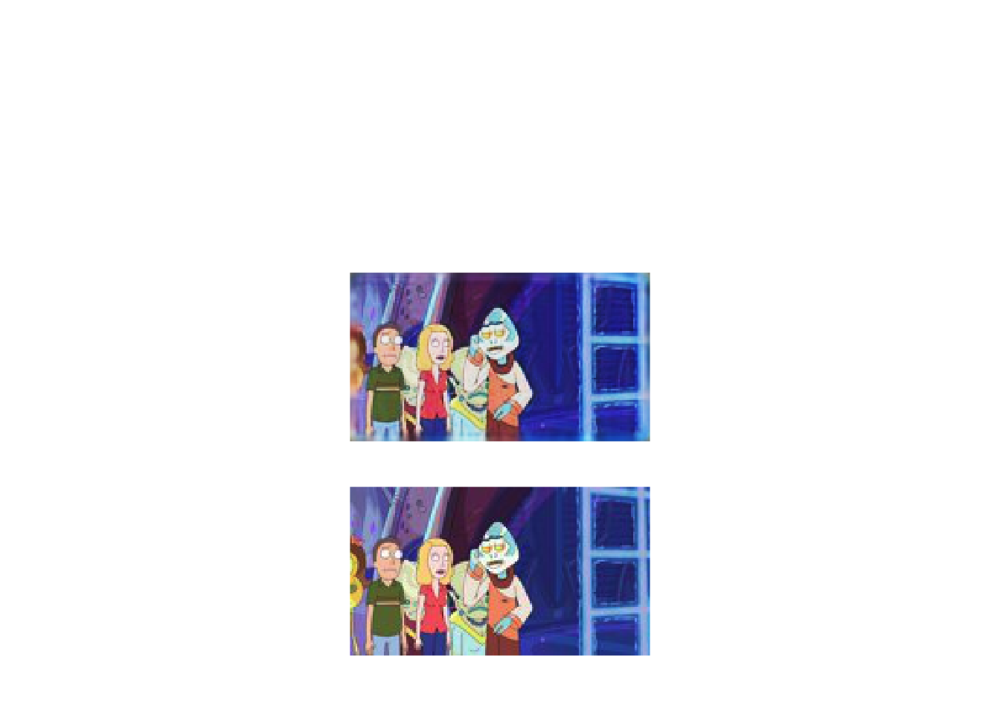


```r
grid::grid.newpage()
grid.raster(predictX[2,1:90,1:160,1:3], interpolate=FALSE, width = 0.3, x = 0.5, y=0.2)
grid.raster(predictAEX[2,1:90,1:160,1:3], interpolate=FALSE, width = 0.3, x = 0.5, y=0.5)
```


```r
grid::grid.newpage()
grid.raster(predictX[3,1:90,1:160,1:3], interpolate=FALSE, width = 0.3, x = 0.5, y=0.2)
grid.raster(predictAEX[3,1:90,1:160,1:3], interpolate=FALSE, width = 0.3, x = 0.5, y=0.5)
```

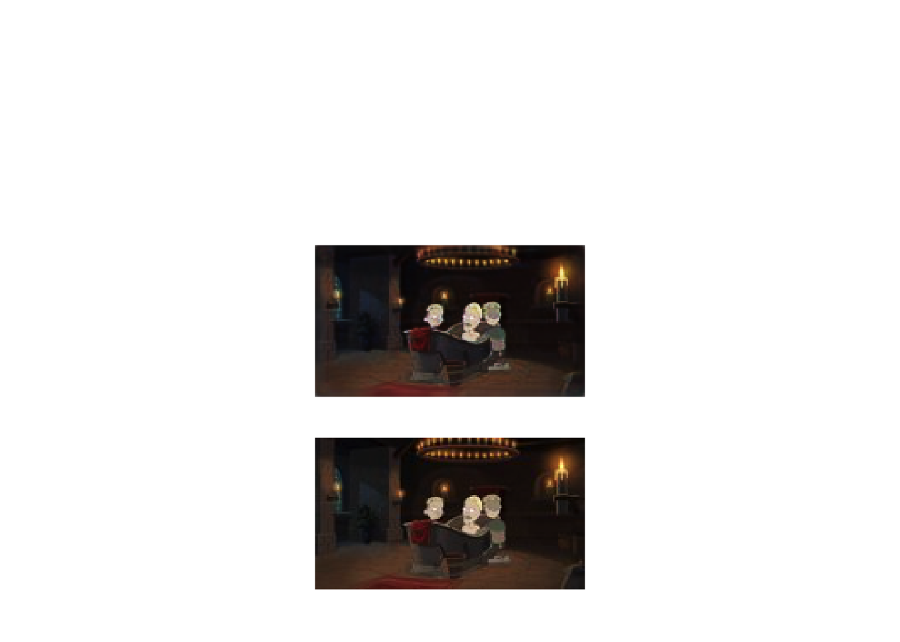

Exercise 2.4: Think about how the script can be modified to demonstrate the use of a denoisiny algorithm (hint: the dataset will need to be modified in some way, but the algorithm itself should be functional as is).

## Further reading

A particularly comprehensive introduction to *Deep Learning* can be found in [Neural Networks and Deep Learning](http://neuralnetworksanddeeplearning.com/chap3.html), written by Michael Nielsen.

Useful examples can also be found in the [keras documentation](https://keras.io), with many more examples found in the keras [R wrapper documentation](https://keras.rstudio.com/index.html).

[Deep Learning with R](https://www.manning.com/books/deep-learning-with-r) is also a fatastic resource for those wishing to continue in this field.

=======
## Exercises

Solutions to exercises can be found in appendix \@ref(solutions-nnet).
